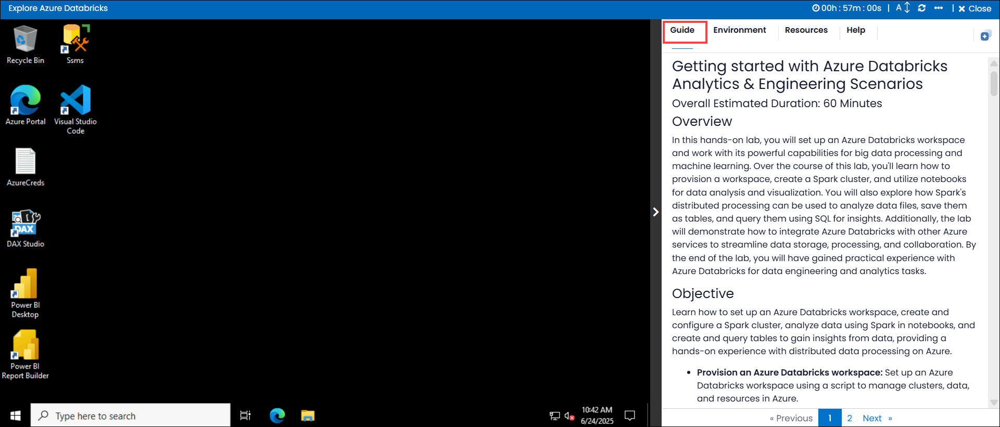
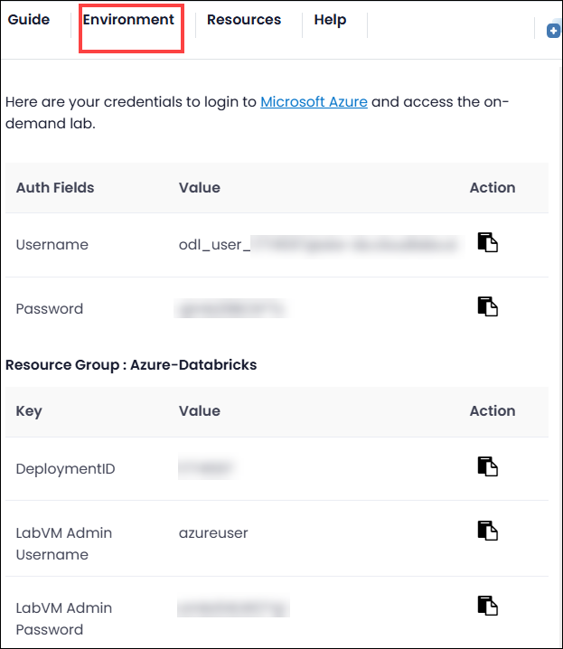
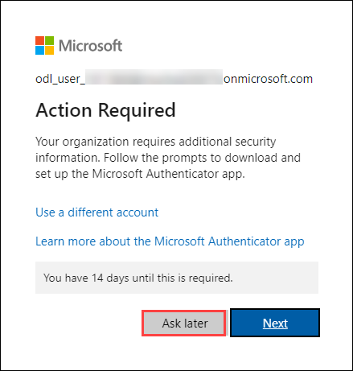

# Getting started with Azure Databricks Analytics & Engineering Scenarios

### Overall Estimated Duration: 60 Minutes

## Overview

In this hands-on lab, you will set up an Azure Databricks workspace and work with its powerful capabilities for big data processing and machine learning. Over the course of this lab, you'll learn how to provision a workspace, create a Spark cluster, and utilize notebooks for data analysis and visualization. You will also explore how Spark's distributed processing can be used to analyze data files, save them as tables, and query them using SQL for insights. Additionally, the lab will demonstrate how to integrate Azure Databricks with other Azure services to streamline data storage, processing, and collaboration. By the end of the lab, you will have gained practical experience with Azure Databricks for data engineering and analytics tasks.

## Objective

Learn how to set up an Azure Databricks workspace, create and configure a Spark cluster, analyze data using Spark in notebooks, and create and query tables to gain insights from data, providing a hands-on experience with distributed data processing on Azure.

- **Provision an Azure Databricks workspace:** Set up an Azure Databricks workspace using a script to manage clusters, data, and resources in Azure. 

- **Create a cluster:** Create a single-node Spark cluster within the Azure Databricks workspace to process data.

- **Use Spark to analyze a data file:** Upload a CSV file and use Spark within a Databricks notebook to explore and visualize the data.

- **Create and query table:** Save data as a table and use SQL queries to retrieve insights from the structured data.

## Prerequisites

Participants should have:

- **Fundamentals of Databricks and Apache Spark:** Awareness of how Databricks works and a basic understanding of Spark concepts like clusters, data processing, and notebooks.

- **General Data Science and Visualization Concepts:** Knowledge of visualizing data using charts and graphs.

- **Understanding of Cloud Shell:** Experience with using Azure Cloud Shell for running scripts and managing Azure resources.

## Architecture

The architecture involves using **Azure Databricks** to enable distributed data processing and advanced analytics with Apache Spark. The **Databricks workspace** serves as the centralized environment for managing resources, clusters, and notebooks. A **Spark cluster** is deployed to perform data processing tasks, with a single-node configuration for simplicity in this lab. The **Databricks File System (DBFS)** provides distributed storage for uploading and accessing data files. Interactive **notebooks** are used as the primary interface for running Spark code in Python or SQL, facilitating data analysis and visualization. The processed data is stored as **tables** within Databricks for structured querying using SQL. The platform integrates with **Azure Active Directory** for authentication and access control. This architecture supports scalable data analytics, collaborative development, and efficient data exploration within the Azure cloud ecosystem.

## Architecture Diagram

   

## Explanation of Components

The architecture for this lab involves the following key components:

- **Azure Databricks Workspace**: This is the central hub for managing and organizing resources, clusters, and notebooks. It integrates Apache Spark with Azure, enabling seamless data processing, collaborative development, and interactive analysis.

- **Apache Spark Cluster**: A key component in Databricks, it enables distributed data processing by using multiple nodes (or a single node in this lab). The cluster performs computations in parallel, speeding up data analysis tasks and handling large datasets efficiently.

- **Databricks File System (DBFS)**: This distributed storage system is used to store and manage data files within the Databricks environment. It facilitates easy data access and ensures data persistence for analysis within the notebooks.

- **Databricks Notebooks**: These provide an interactive interface for writing and executing Spark code in languages like Python and SQL. Notebooks combine documentation, data analysis, and visualization into a single environment for efficient exploration and insight generation.

## Getting Started with Lab
 
Once you're ready to dive in, your virtual machine and guide will be right at your fingertips within your web browser.
 

### Virtual Machine & Guide
 
In the integrated environment, the lab VM serves as the designated workspace, while the guide is accessible on the right side of the screen.

**Note**: Kindly ensure that you are following the instructions carefully to ensure the lab runs smoothly and provides an optimal user experience.
 
 
## Exploring Your Lab Resources
 
To get a better understanding of your lab resources and credentials, navigate to the **Environment** tab.
 

 
## Utilizing the Split Window Feature
 
For convenience, you can open the guide in a separate window by selecting the **Split Window** button from the Top right corner.
 

 
## Managing Your Virtual Machine
 
Feel free to **start, stop, or restart** your virtual machine as needed from the **Resources** tab. Your experience is in your hands!
 

## Lab Guide Zoom In/Zoom Out

To adjust the zoom level for the environment page, click the **A↕ : 100%** icon located next to the timer in the lab environment.

## **Lab Duration Extension**

1. To extend the duration of the lab, kindly click the **Hourglass** icon in the top right corner of the lab environment. 

    

    >**Note:** You will get the **Hourglass** icon when 10 minutes are remaining in the lab.

1. Click **OK** to extend your lab duration.
 
   

1. If you have not extended the duration prior to when the lab is about to end, a pop-up will appear, giving you the option to extend. Click **OK** to proceed.
 
## Let's Get Started with Azure Portal
 
1. In the **JumpVM**, click on the **Azure portal shortcut** of the Microsoft Edge browser, which is created on the desktop.
 
   .png)

 
1. On the **Sign in to Microsoft Azure** tab, you will see the login screen, in that enter the following email/username, and click on **Next**.
 
   - **Email/Username:** <inject key="AzureAdUserEmail"></inject>
 
       
 
1. Now enter the following password and click on **Sign in**.
 
   - **Password:** <inject key="AzureAdUserPassword"></inject>
 
      
 
1. If prompted to stay signed in, you can click "No."

   

1. If **Action Required** pop-up window appears, click on **Ask later**.

     
 
1. If a **Welcome to Microsoft Azure** pop-up window appears, simply click "Cancel" to skip the tour.

    

## Support Contact
 
The CloudLabs support team is available 24/7, 365 days a year, via email and live chat to ensure seamless assistance at any time. We offer dedicated support channels tailored specifically for both learners and instructors, ensuring that all your needs are promptly and efficiently addressed.

Learner Support Contacts:
- Email Support: cloudlabs-support@spektrasystems.com
- Live Chat Support: https://cloudlabs.ai/labs-support

Click "Next" from the bottom right corner to embark on your Lab journey!
 
   .png)
 
### Happy Learning!!
