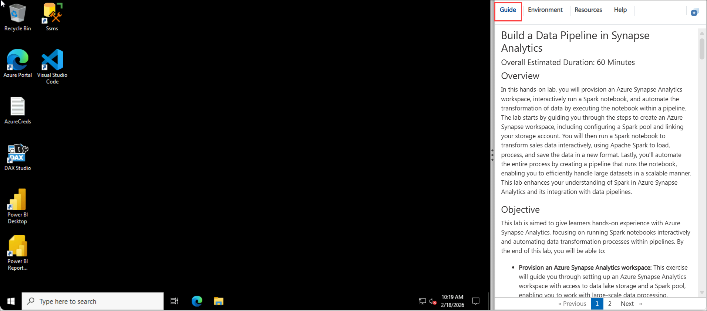
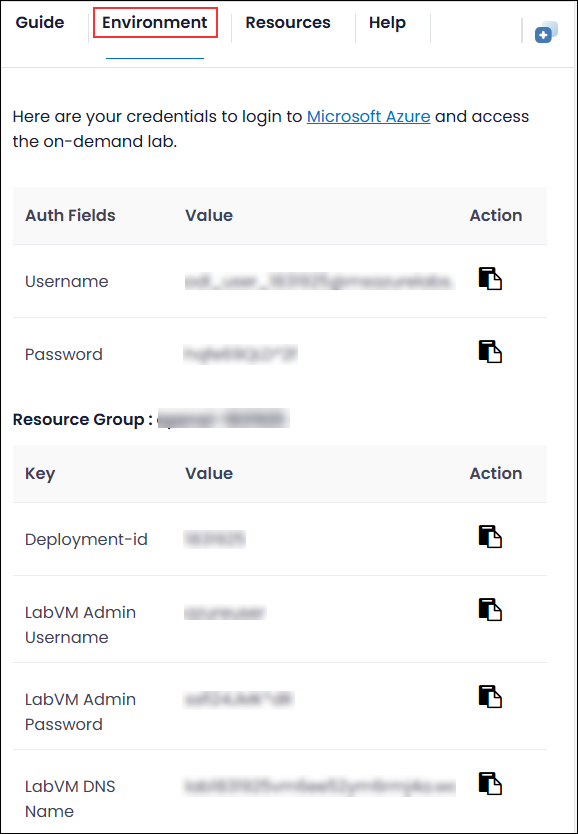
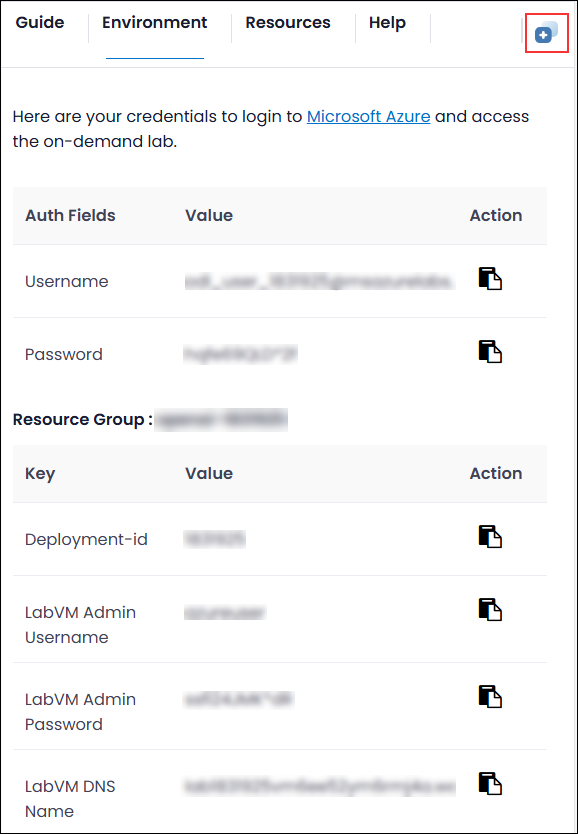
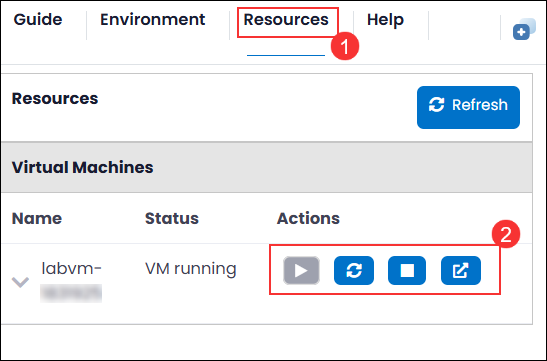

# Using Apache Spark Notebook in pipeline

### Overall Estimated Duration: 120 Minutes

## Overview

In this hands-on lab on **Using Apache Spark Notebook in a Pipeline**, you will provision and configure an Apache Spark notebook environment and integrate it into a data pipeline to process, transform, and analyze large-scale datasets efficiently. You will learn how to create a Spark session, connect to data sources, perform distributed data transformations, and validate outputs within a structured pipeline workflow. By the end of the lab, you will understand how Apache Spark notebooks can be used to build scalable data processing stages, automate tasks, and support end-to-end data engineering processes in modern analytics environments.

## Objective

This lab is designed to provide learners with hands-on experience in using an Apache Spark notebook within a data pipeline to perform scalable data processing and automation. By the end of this lab, you will be able to:

* **Provision a Spark notebook environment:** This exercise will guide you through setting up an Apache Spark notebook environment, configuring the necessary compute resources, and connecting to relevant data sources to enable distributed data processing.

* **Run a Spark notebook interactively:** You will learn how to create and execute Spark code within a notebook, perform data transformations, analyze results, and validate outputs interactively.

* **Integrate and automate notebook execution in a pipeline:** You will build and configure a data pipeline that triggers the Spark notebook automatically, enabling streamlined, repeatable, and scalable data transformation workflows.

## Prerequisites

Participants should have:

- **Azure Synapse Analytics:** Familiarity with Azure Synapse Analytics, including understanding its components like workspaces, Spark pools, and data integration.

- **Apache Spark and Notebooks:** Knowledge of Spark concepts and how to work with Spark notebooks for data processing and transformation.

- **Azure Data Lake Storage:** Understanding of Azure Data Lake Storage and how to manage and interact with data stored in it.

- **Azure Pipelines:** Knowledge of creating and managing data pipelines in Azure Synapse, including configuring activities and linking them to notebooks for automation.

## Architecture

The architecture for this lab consists of a data source layer (such as cloud storage or a data lake) that stores raw input data, a processing layer powered by an Apache Spark notebook where distributed data transformations and analytics are performed, and an orchestration layer that integrates the notebook into a pipeline to automate execution. The pipeline triggers the Spark notebook, which reads data from the storage layer, processes and transforms it using Spark’s distributed computing capabilities, and writes the transformed output back to a designated storage location for downstream consumption, reporting, or further analytics. This layered architecture ensures scalability, automation, and efficient end-to-end data processing within a modern data engineering workflow.

## Architecture Diagram

   

## Explanation of Components

The architecture for this lab involves the following key components:

- **Azure Synapse Analytics Workspace:** This is the core environment where data processing and transformation tasks are managed. It integrates various services, including Spark pools and Data Lake Storage, enabling seamless data operations and analytics.

- **Apache Spark Pool:** A cluster of resources in Synapse that provides scalable distributed processing power for running Spark notebooks. It's essential for processing large datasets in parallel, making it ideal for big data transformations.

- **Azure Synapse Pipelines:** These are used for orchestrating and automating data workflows. By encapsulating the Spark notebook in a pipeline, it enables efficient automation of data transformation tasks, improving scalability and repeatability.

## Getting Started with Lab
 
Once you're ready to dive in, your virtual machine and lab guide will be right at your fingertips within your web browser.
 

### Virtual Machine & Lab Guide
 
Your virtual machine is your workhorse throughout the workshop. The lab guide is your roadmap to success.
 
## Exploring Your Lab Resources
 
To get a better understanding of your lab resources and credentials, navigate to the **Environment** tab.
 

 
## Utilizing the Split Window Feature
 
For convenience, you can open the lab guide in a separate window by selecting the **Split Window** button from the Top right corner.
 

 
## Managing Your Virtual Machine
 
Feel free to start, stop, or restart your virtual machine as needed from the **Resources** tab. Your experience is in your hands!
 

 
## Let's Get Started with Azure Portal
 
1. On your virtual machine, click on the Azure Portal icon as shown below:
 
   .png)

 
2. You'll see the **Sign into Microsoft Azure** tab. Here, enter your credentials:
 
   - **Email/Username:** <inject key="AzureAdUserEmail"></inject>
 
       
 
3. Next, provide your password:
 
   - **Password:** <inject key="AzureAdUserPassword"></inject>
 
      
 
4. If prompted to stay signed in, you can click "No."

    

5. If **Action required** pop-up window appears, click on **Ask later**.

   

6. If a **Welcome to Microsoft Azure** pop-up window appears, simply click "Cancel" to skip the tour.

    

## Support Contact
 
The CloudLabs support team is available 24/7, 365 days a year, via email and live chat to ensure seamless assistance at any time. We offer dedicated support channels tailored specifically for both learners and instructors, ensuring that all your needs are promptly and efficiently addressed.

Learner Support Contacts:
- Email Support: cloudlabs-support@spektrasystems.com
- Live Chat Support: https://cloudlabs.ai/labs-support

Click "Next" from the bottom right corner to embark on your Lab journey!
 
   .png)
 
### Happy Learning!!