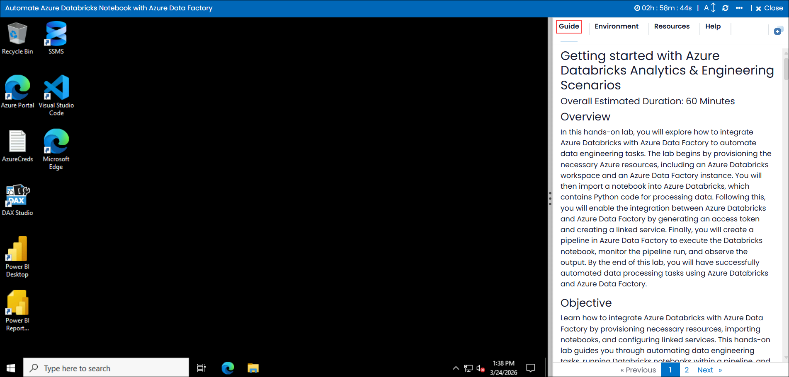
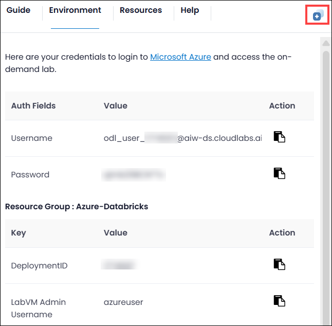
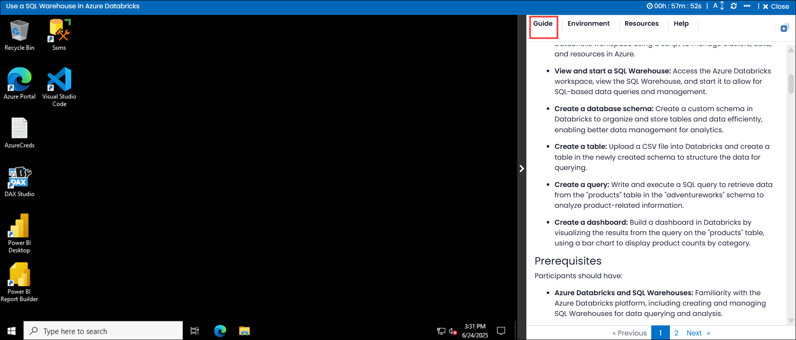
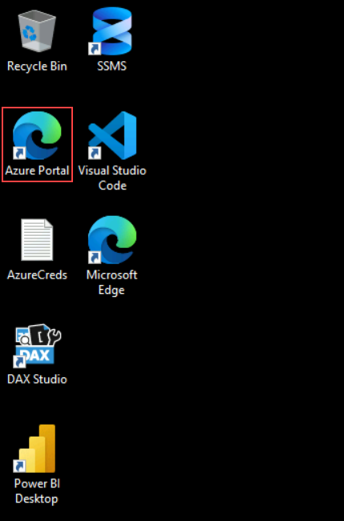
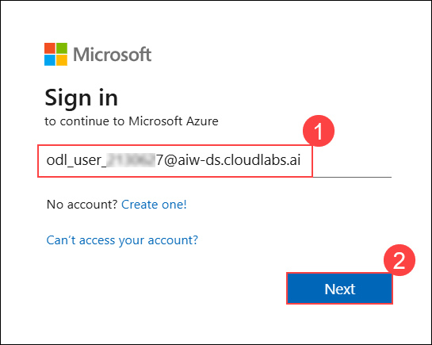
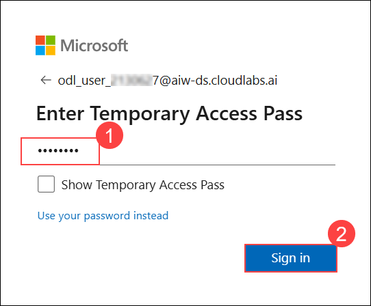
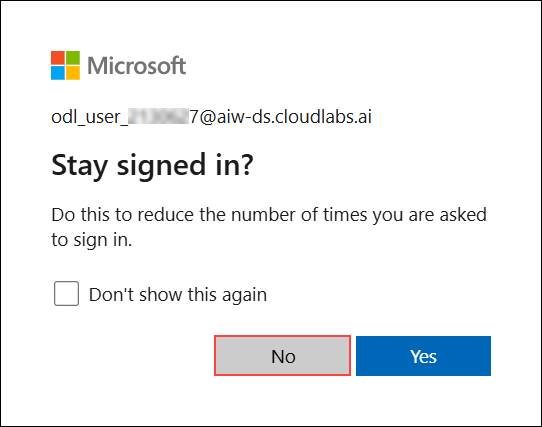

# Getting started with Azure Databricks Analytics & Engineering Scenarios

### Overall Estimated Duration: 60 Minutes

## Overview

In this hands-on lab, you will explore how to integrate Azure Databricks with Azure Data Factory to automate data engineering tasks. The lab begins by provisioning the necessary Azure resources, including an Azure Databricks workspace and an Azure Data Factory instance. You will then import a notebook into Azure Databricks, which contains Python code for processing data. Following this, you will enable the integration between Azure Databricks and Azure Data Factory by generating an access token and creating a linked service. Finally, you will create a pipeline in Azure Data Factory to execute the Databricks notebook, monitor the pipeline run, and observe the output. By the end of this lab, you will have successfully automated data processing tasks using Azure Databricks and Azure Data Factory.

## Objective

Learn how to integrate Azure Databricks with Azure Data Factory by provisioning necessary resources, importing notebooks, and configuring linked services. This hands-on lab guides you through automating data engineering tasks, running Databricks notebooks within a pipeline, and monitoring the results, providing a comprehensive experience with orchestrating and automating data workflows on Azure.

- **Provision Azure resources:** Use a script to provision an Azure Databricks workspace and an Azure Data Factory resource in your Azure subscription.  

- **Import a notebook:** Import an existing Python-based notebook into your Azure Databricks workspace to process and manage data.  

- **Enable Azure Databricks integration with Azure Data Factory:** Generate an access token in Azure Databricks and create a linked service in Azure Data Factory to establish the connection.  

- **Use a pipeline to run the Azure Databricks notebook:** Create and configure a pipeline in Azure Data Factory to execute the Databricks notebook and monitor its execution.

## Prerequisites

Participants should have:

- **Provision an Azure Databricks workspace:** Set up an Azure Databricks workspace using a script to manage clusters, data, and resources in Azure.

- **Azure Data Factory Fundamentals:** Understanding of Azure Data Factory, pipelines, and linked services for orchestrating data workflows and integrating with external services.

- **Azure Authentication and Access Management:** Knowledge of generating access tokens and configuring authentication for Azure services like Databricks and Data Factory.

- **Understanding of Cloud Shell:** Experience with using Azure Cloud Shell for running scripts and managing Azure resources.

- **Data Engineering Concepts:** Understanding of how to process, manage, and transform data using distributed compute frameworks like Apache Spark in Databricks.

## Architecture

The architecture involves using the **Azure Databricks** platform and **Azure Data Factory** to automate data processing workflows. Azure Databricks serves as the platform for running data engineering tasks, such as processing and transforming data using Spark clusters. Azure Data Factory is used to orchestrate these tasks by creating a pipeline that triggers the execution of the Databricks notebooks. The **pipeline** is linked to the Databricks workspace via a linked service, using an access token for authentication. **Data processing workflows** are initiated through this pipeline, with the output of the Databricks notebook saved in Azure storage or Databricks File System (DBFS), allowing seamless integration between the two services to automate data processing and management.

## Architecture Diagram

   

## Explanation of Components

The architecture for this lab involves the following key components:

- **Azure Databricks Workspace:** A collaborative environment that provides a managed Apache Spark platform for processing large datasets, running notebooks, and leveraging Spark clusters for distributed data processing and machine learning tasks.

- **Azure Data Factory Pipeline:** A workflow orchestration tool used to automate and schedule data processing tasks. It enables the creation of data pipelines that integrate with various services like Azure Databricks for executing notebooks and managing data movement.

- **Access Tokens for Authentication:** Used to securely authenticate and authorize communication between Azure Databricks and Azure Data Factory. These tokens are essential for establishing a secure linked service connection and enabling data processing tasks within the pipeline.

## Getting Started with Lab
 
Once you're ready to dive in, your virtual machine and guide will be right at your fingertips within your web browser.
 

### Virtual Machine & Guide
 
In the integrated environment, the lab VM serves as the designated workspace, while the guide is accessible on the right side of the screen.

**Note**: Kindly ensure that you are following the instructions carefully to ensure the lab runs smoothly and provides an optimal user experience.
 
## Exploring Your Lab Resources
 
To get a better understanding of your lab resources and credentials, navigate to the **Environment** tab.
 

 
## Utilizing the Split Window Feature
 
For convenience, you can open the guide in a separate window by selecting the **Split Window** button from the Top right corner.
 

 
## Managing Your Virtual Machine
 
Feel free to **start, stop, or restart** your virtual machine as needed from the **Resources** tab. Your experience is in your hands!
 

## Lab Guide Zoom In/Zoom Out

To adjust the zoom level for the environment page, click the **A↕: 100%** icon located next to the timer in the lab environment.

## Let's Get Started with Azure Portal
 
1. In the **JumpVM**, click on the **Azure portal shortcut** of the Microsoft Edge browser, which is created on the desktop.
 
   
 
1. On the **Sign in to Microsoft Azure** tab, you will see the login screen, in that enter the following email/username, and click on **Next**.
 
   - **Email:** <inject key="AzureAdUserEmail"></inject>
 
       
 
1. Now enter the following password and click on **Sign in**.
 
   - **Temporary Access Pass:** <inject key="AzureAdUserPassword"></inject>
 
      
 
1. If prompted to stay signed in, you can click **No**.

   

## Support Contact
 
The CloudLabs support team is available 24/7, 365 days a year, via email and live chat to ensure seamless assistance at any time. We offer dedicated support channels tailored specifically for both learners and instructors, ensuring that all your needs are promptly and efficiently addressed.

Learner Support Contacts:
- Email Support: cloudlabs-support@spektrasystems.com
- Live Chat Support: https://cloudlabs.ai/labs-support

Click **Next** from the bottom right corner to embark on your Lab journey!
 
   
 
### Happy Learning!!