# Lab 01: Explore Azure Databricks

## Overview

Azure Databricks is a Microsoft Azure-based version of the popular open-source Databricks platform.

Similarly to Azure Synapse Analytics, an Azure Databricks **workspace** provides a central point for managing Databricks clusters, data, and resources on Azure.

In this lab, you'll learn about Azure Databricks workspace, which provides a central point for managing Databricks clusters, data, and resources on Azure.

### Objectives

In this lab, you will perform:

 - Task 1: Provision an Azure Databricks workspace
 - Task 2: Create a cluster
 - Task 3: Use Spark to analyze a data file
 - Task 4: Create and query a table

## Task 1: Provision an Azure Databricks workspace

In this task, you'll use a script to provision a new Azure Databricks workspace.

1. In a web browser, navigate to the **Azure portal**, open the following URL in the address bar, and sign in with the Lab credentials if you are not already signed in.

    ```
    https://portal.azure.com
    ```
   
1. Use the **[\>_]** **icon** to the right of the search bar to create a new **Cloud Shell** in the Azure portal.

    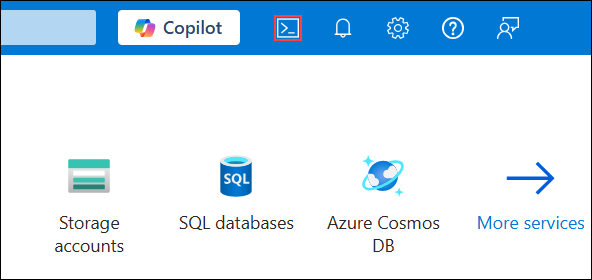

1. In the **Welcome to Azure Cloud Shell** pane, select **PowerShell**.

    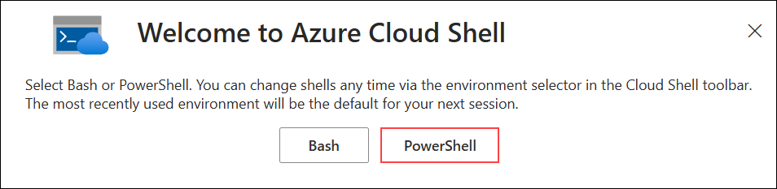

1. Within the Getting started pane, select **Mount storage account (1)**, select your **Storage account subscription (2)** from the dropdown and click **Apply (3)**.

    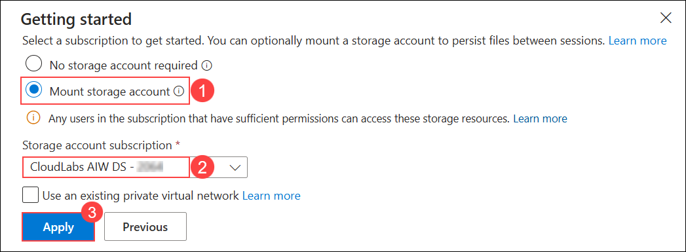

1. In the **Mount storage account** pane, select **I want to create a storage account (1)** and click **Next (2)**.

    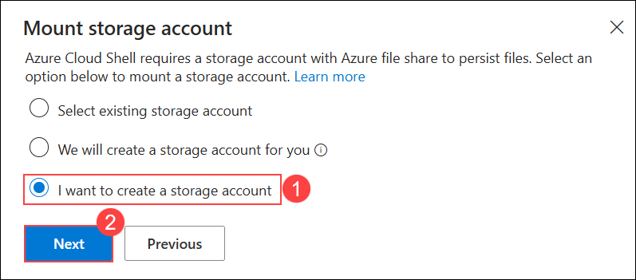

1. In the **Create storage account** pane, provide the following details:

    - **Subscription (1)**: Select the defualt **Subscription**  
    - **Resource group (2)**: Select **Azure-Databricks**  
    - **Region (3)**: Select **(US) East US**  
    - **Storage account name (4)**: Enter **storage<inject key="DeploymentID" enableCopy="false"/>**  
    - **File share (5)**: Enter **fileshare1**  
    - select **Create (6)**.

        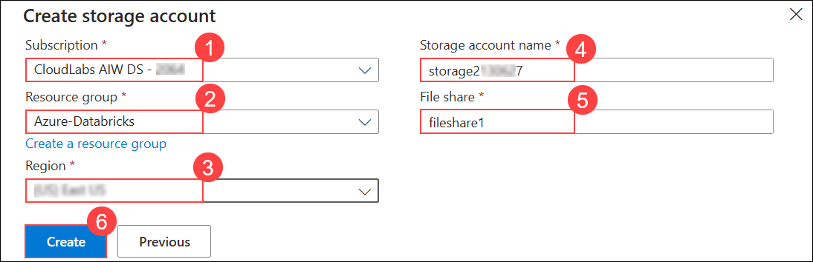

1. In the **Deployment is in progress** notification, wait for the PowerShell terminal to start.

    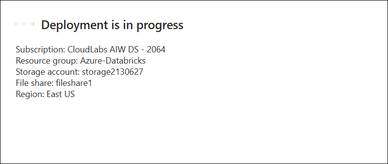

1. In the PowerShell pane, paste the following **commands** and click **Enter** to clone this repo:

    ```
    rm -r dp-203-azure-data-engineer -f
    git clone -b guidedlabs --single-branch https://github.com/CloudLabs-MOC/dp-203-azure-data-engineer.git
    ```

    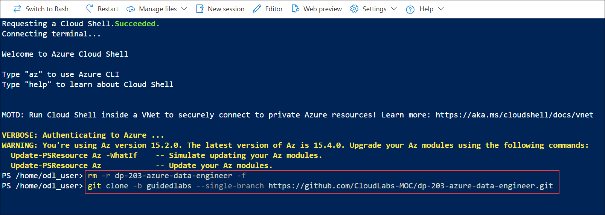

1. After the repo has been cloned, enter the following commands to change to the folder for this lab and run the **setup.ps1** script it contains:

    ```
    cd dp-203-azure-data-engineer/Allfiles/labs/23
    ./setup.ps1
    ```

    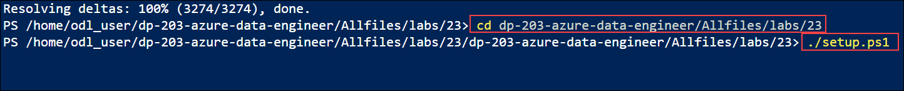

1. Wait for the script to complete (this may take a few minutes), and while waiting, review the following documentation.

    ```
    https://learn.microsoft.com/azure/databricks/introduction/
    ```

   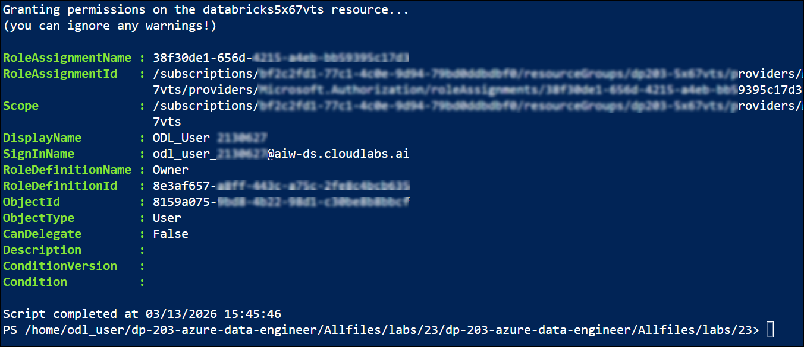

1. In the **Cloud Shell** window, select the **X** at the top right corner to close it after the script execution completes.

   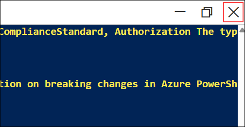

## Task 2: Create a cluster

Azure Databricks is a distributed processing platform that uses Apache Spark **clusters** to process data in parallel on multiple nodes. Each cluster consists of a driver node to coordinate the work and worker nodes to perform processing tasks.

In this task, you will create a cluster in the Azure Databricks Portal.

> **Note**: In this exercise, you'll create a **single-node** cluster to minimize the compute resources used in the lab environment (in which resources may be constrained). In a production environment, you'd typically create a cluster with multiple worker nodes.

1. In the **Search resources, services, and docs (G+/) (1)** box, enter **dp203-<inject key="DeploymentID" enableCopy="false"/>**, and then select the **Resource group (2)**.

    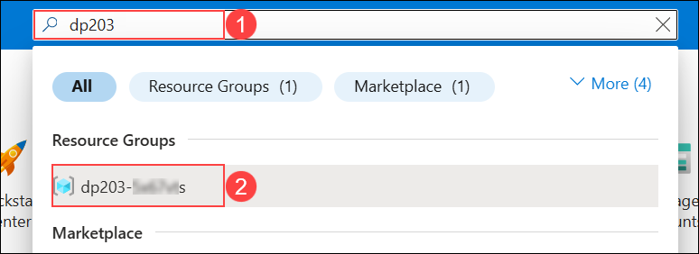
 
1. In the **Overview (1)** page, select the **databricks<inject key="DeploymentID" enableCopy="false"/> (2)** resource.

    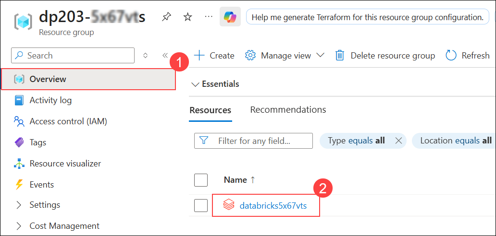

1. In the **Overview** page, select **Launch Workspace**.

    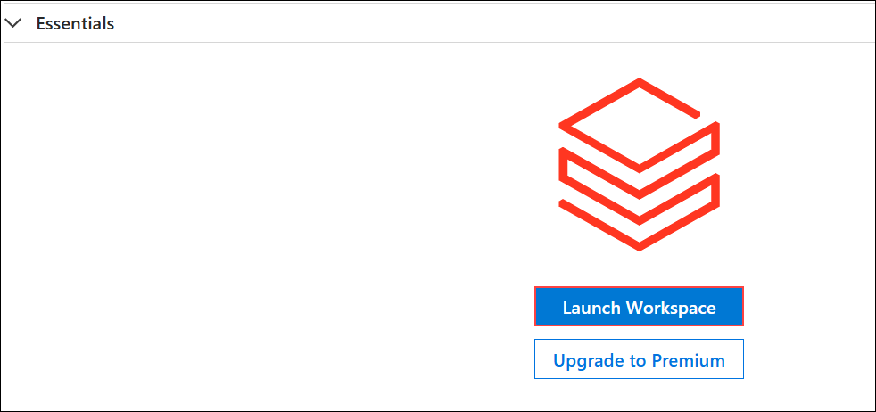

    > **Note**: In the Databricks Workspace portal, dismiss any tips or notifications that appear, and continue with the lab instructions.

1. View the **Azure Databricks workspace portal** and note that the sidebar on the left side contains links for the various types of tasks you can perform.

1. Select the **+ New (1)** link in the sidebar, and then select **More (2)** ,then click on **Cluster (3)**.

    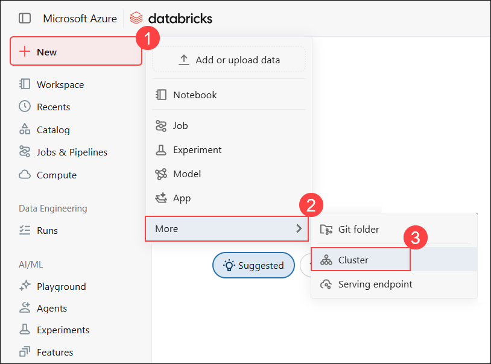
 
1. In the **Create new compute** page, provide the following details:

    - **Compute name (1)**: Keep the **default** value  
    - **Databricks runtime (2)**: Select **13.3 LTS**  
    - **Preferred node type (3)**: Select **Standard_DS3_v2**  
    - **Single node (4)**: Select  
    - **Terminate after (5)**: Enter **30** minutes  
    - select **Create (6)**.

        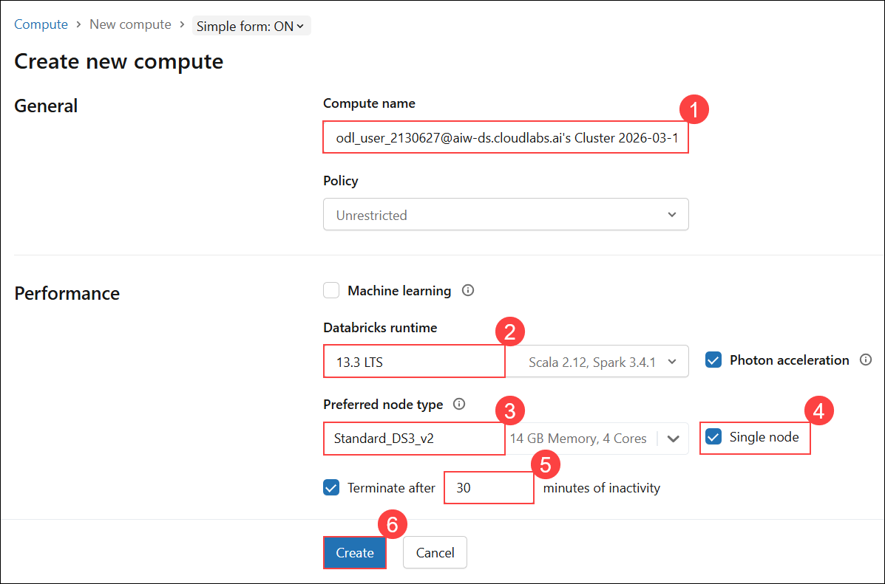

1. In the cluster page, wait until the status indicator shows the cluster is running.

    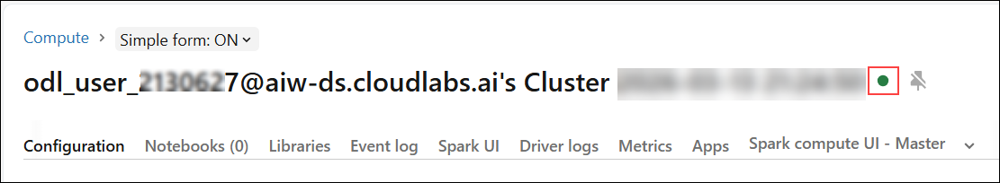

    > **Note**: If your cluster fails to start, your subscription may have insufficient quota in the region where your Azure Databricks workspace is provisioned. See [CPU core limit prevents cluster creation](https://docs.microsoft.com/azure/databricks/kb/clusters/azure-core-limit) for details. If this happens, you can try deleting your workspace and creating a new one in a different region. You can specify a region as a parameter for the setup script like this: `./setup.ps1 eastus`

## Task 3: Use Spark to analyze a data file

As in many Spark environments, Databricks supports the use of notebooks to combine notes and interactive code cells that you can use to explore data.

In this task, you will use the notebook feature in Azure Databricks in which it uses Spark for querying and exploring data.

1. In the sidebar, use the **(+) New (1)** link to create a **Notebook (2)**.

    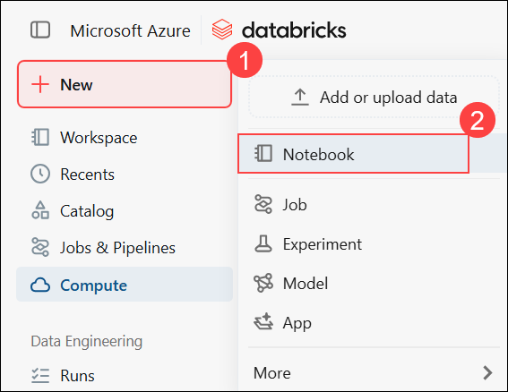

1. In the notebook, rename it to **Explore products**.

    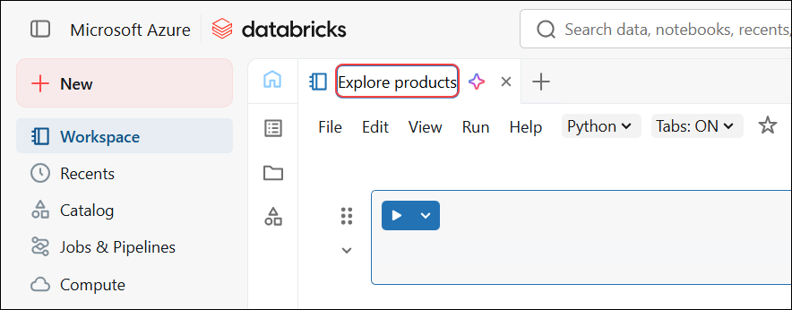

1. In the **Connect** drop-down list, select your cluster if it is not already selected.

    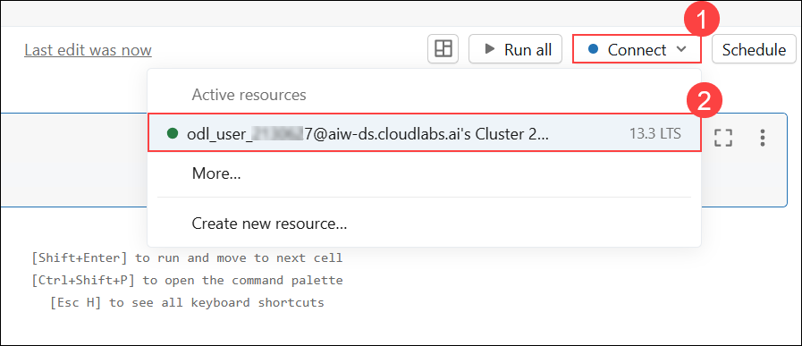

    > **Note**: If the cluster is not running, it may take a minute or so to start.

1. In the **LabVM**, download the following file and save it as **products.csv**.

    ```
    https://raw.githubusercontent.com/CloudLabs-MOC/dp-203-azure-data-engineer/guidedlabs/Allfiles/labs/23/adventureworks/products.csv
    ```

1. In the **Explore products** notebook select **File (1)** and choose **Upload data to DBFS (2)**.

    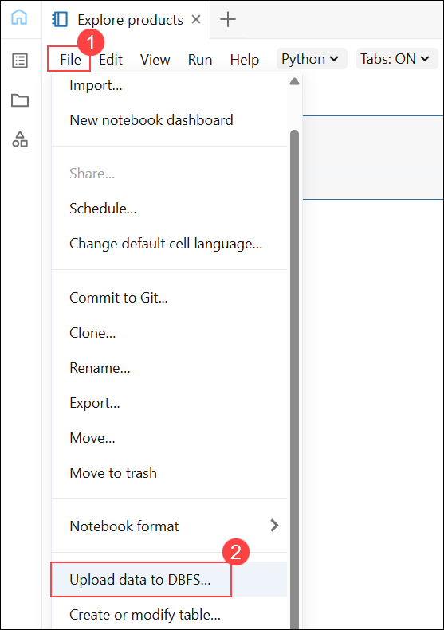

1. In the **Upload Data** dialog box, note the **DBFS Target Directory** to where the file will be uploaded. Then select the **Files** area, and upload the **products.csv** file you downloaded to your computer. When the file has been uploaded, select **Next**.

    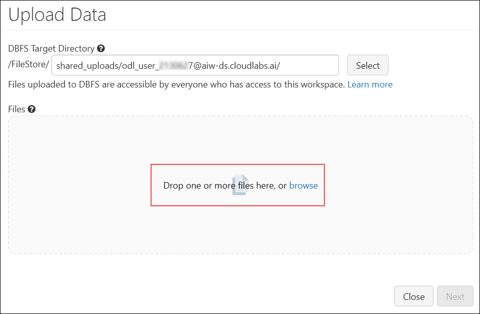

    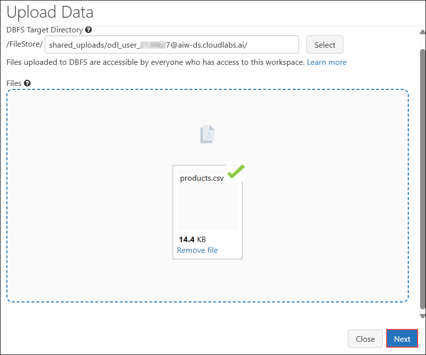
   
1. In the **Access files from notebooks** pane, select **PySpark (1)**, click **Copy (2)** to copy the code, and then select **Done (3)**.

   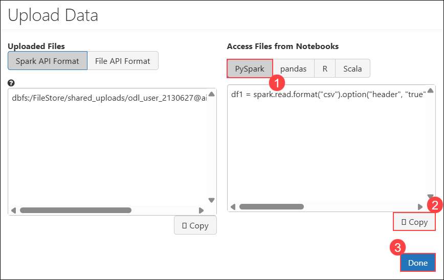
   
1. In the **Explore products** notebook, in the empty code cell, paste the code you copied; which should look similar to this:

    ```python
    df1 = spark.read.format("csv").option("header", "true").load("dbfs:/FileStore/shared_uploads/<inject key="AzureAdUserEmail" enableCopy="false"/>/products.csv")
    ```

1. Use the **&#9656; Run Cell** to execute the code.

    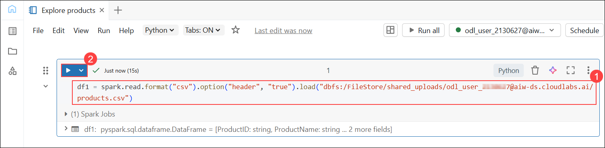

1. In the code cell output, verify that the **df1** dataframe is created after the Spark job completes.

    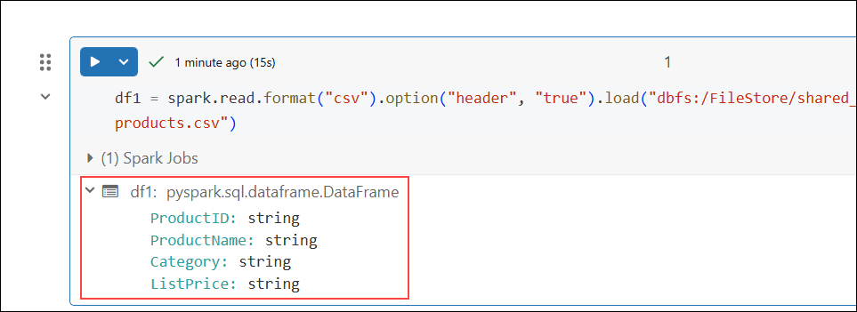
   
1. Below the existing code cell, select **+ Code** to add a new code cell.

    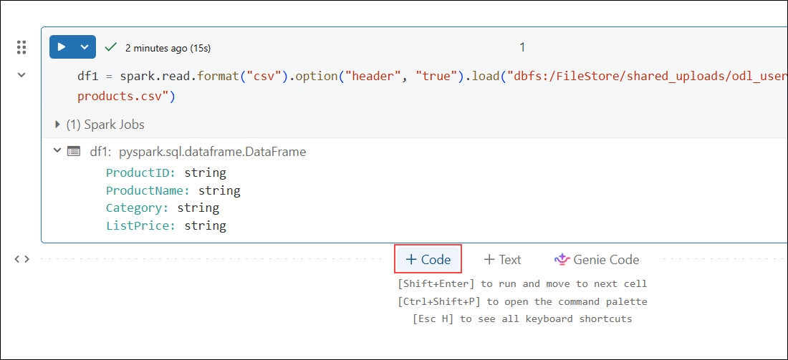

    > **Note**: Hover below the existing code cell to display the **+ Code** option if it is not visible.

1. Use the **&#9656; Run Cell** menu option at the top-right of the new cell to run it.

    ```python
    display(df1)
    ```

    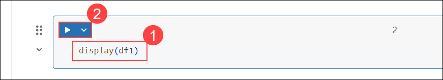
    
1. This code displays the contents of the dataframe, which should look similar to this:
    
   | ProductID | ProductName | Category | ListPrice |
   | -- | -- | -- | -- |
   | 771 | Mountain-100 Silver, 38 | Mountain Bikes | 3399.9900 |
   | 772 | Mountain-100 Silver, 42 | Mountain Bikes | 3399.9900 |
   | ... | ... | ... | ... |
    
1. Above the table of results, select **+ (1)** and then select **Visualization (2)** to view the visualization editor.

   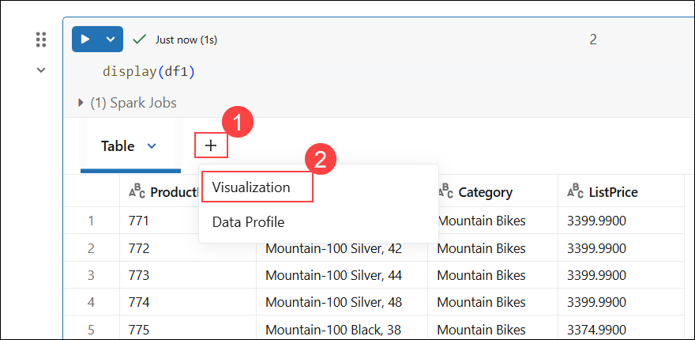
     
1. In the **Visualization Editor**, configure the following:

    - **Visualization type (1)**: Select **Bar**  
    - **X column (2)**: Select **Category**  
    - **Y columns (3)**: Select **Add column**, and choose **ProductID (4)** with **Count** aggregation

        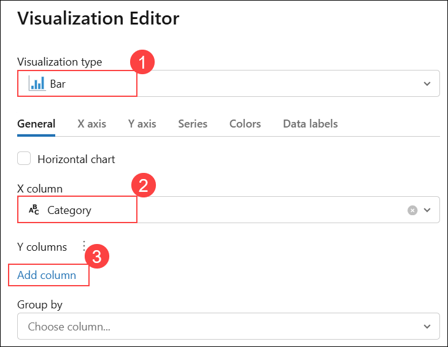

        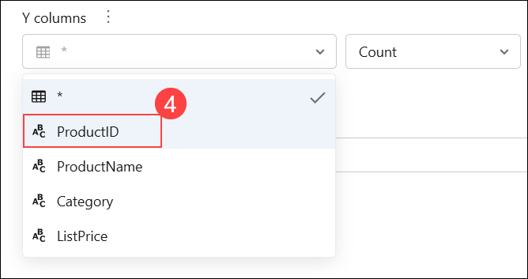

1. In the **Visualization Editor**, select **Save**.

   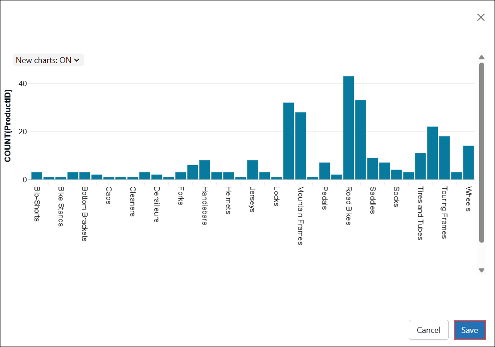

## Task 4: Create and query a table

While many data analysis are comfortable using languages like Python or Scala to work with data in files, a lot of data analytics solutions are built on relational databases, in which data is stored in tables and manipulated using SQL.

In this task, you will use the notebook which is created previously and query data using various code cells.

1. In the **Explore products** notebook, under the chart output from the previously run code cell, use the **+** icon to add a new cell.

   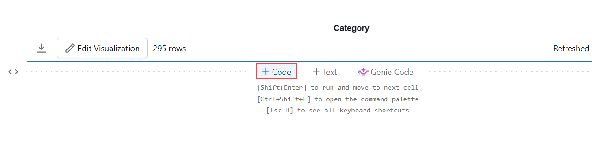
   
1. Enter and run the following code in the new cell:

    ```python
    df1.write.saveAsTable("products")
    ```

   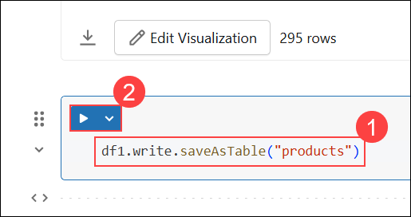

1. When the cell has completed, add a new cell under it with the following code:

    ```sql
    %sql

    SELECT ProductName, ListPrice
    FROM products
    WHERE Category = 'Touring Bikes';
    ```

    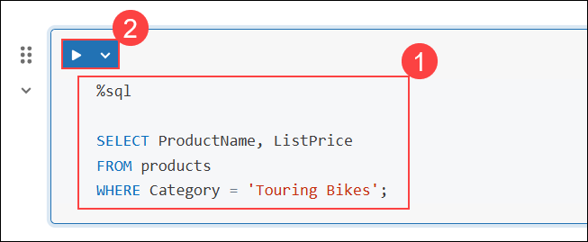

1. Run the new cell, which contains SQL code to return the name and price of products in the **Touring Bikes** category. 

    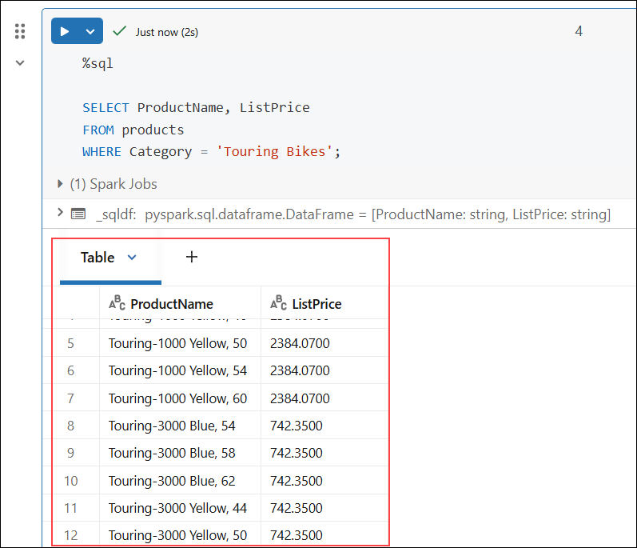
   
1. In the sidebar, select the **Catalog (1)** link, and verify that the **products (3)** table has been created in the **default database schema (2)** (which is unsurprisingly named **default**). It's possible to use Spark code to create custom database schemas and a schema of relational tables that data analysts can use to explore data and generate analytical reports.

    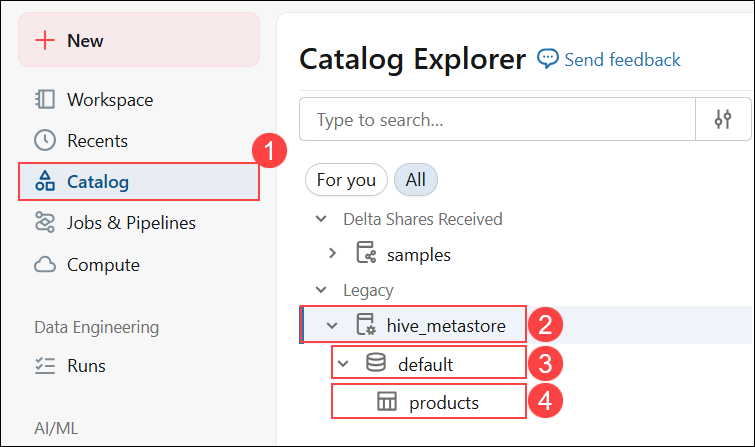

    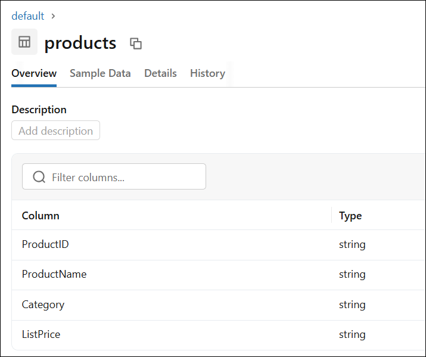

> **Congratulations** on completing the task! Now, it's time to validate it. Here are the steps:
> - Hit the Validate button for the corresponding task. If you receive a success message, you can proceed to the next task. 
> - If not, carefully read the error message and retry the step, following the instructions in the lab guide.
> - If you need any assistance, please contact us at cloudlabs-support@spektrasystems.com. We are available 24/7 to help

<validation step="ff89d27a-7f48-4720-8b81-36b2ae489171" />

## Summary

In this lab, you have performed key tasks to work with Azure Databricks and Spark. You provisioned an Azure Databricks workspace, created a cluster, used Spark to analyze a data file, and then created and queried a database table for data insights.

## You have successfully completed the lab.
