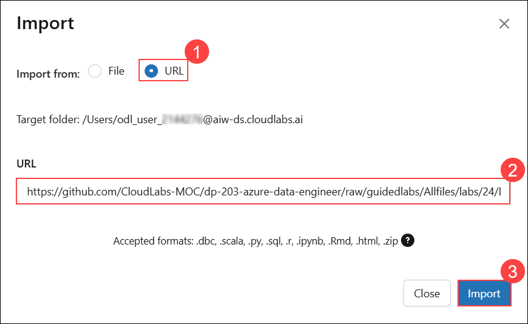
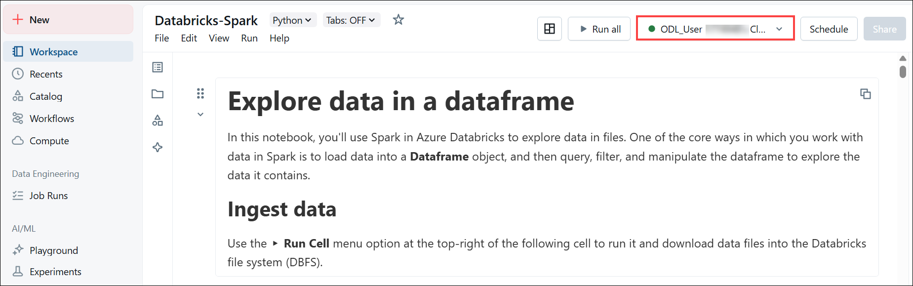

# Lab 02: Use Spark in Azure Databricks

## Overview

Azure Databricks is a Microsoft Azure-based version of the popular open-source Databricks platform. Azure Databricks is built on Apache Spark and offers a highly scalable solution for data engineering and analysis tasks that involve working with data in files. One of the benefits of Spark is support for a wide range of programming languages, including Java, Scala, Python, and SQL, making Spark a very flexible solution for data processing workloads, including data cleansing and manipulation, statistical analysis and machine learning, and data analytics and visualization.

In this lab, you'll learn about Apache Spark clusters to process data in parallel on multiple nodes. As in many Spark environments, Databricks supports the use of notebooks to combine notes and interactive code cells that you can use to explore data.

### Lab Objectives

In this lab, you will perform:

 - Task 1: Provision an Azure Databricks workspace
 - Task 2: Create a cluster
 - Task 3: Explore data using a notebook

## Task 1: Provision an Azure Databricks workspace

In this task, you'll use a script to provision a new Azure Databricks workspace.

1. In a web browser, navigate to the **Azure portal**, open the following URL in the address bar, and sign in with the Lab credentials if you are not already signed in.

    ```
    https://portal.azure.com
    ```
   
1. Use the **[\>_]** **icon** to the right of the search bar to create a new **Cloud Shell** in the Azure portal.

    

1. In the **Welcome to Azure Cloud Shell** pane, select **PowerShell**.

    

1. Within the Getting started pane, select **Mount storage account (1)**, select your **Storage account subscription (2)** from the dropdown and click **Apply (3)**.

    

1. In the **Mount storage account** pane, select **I want to create a storage account (1)** and click **Next (2)**.

    

1. In the **Create storage account** pane, provide the following details:

    - **Subscription (1)**: Select the defualt **Subscription**  
    - **Resource group (2)**: Select **Azure-Databricks**  
    - **Region (3)**: Select **(US) East US**  
    - **Storage account name (4)**: Enter **storage<inject key="DeploymentID" enableCopy="false"/>**  
    - **File share (5)**: Enter **fileshare1**  
    - select **Create (6)**.

        

1. In the **Deployment is in progress** notification, wait for the PowerShell terminal to start.

    

1. In the PowerShell pane, paste the following **commands** and click **Enter** to clone this repo:

    ```
    rm -r dp-203-azure-data-engineer -f
    git clone -b guidedlabs --single-branch https://github.com/CloudLabs-MOC/dp-203-azure-data-engineer.git
    ```

    

1. After the repo has been cloned, enter the following commands to change to the folder for this lab and run the **setup.ps1** script it contains:

    ```
    cd dp-203-azure-data-engineer/Allfiles/labs/24
    ./setup.ps1
    ```

1. Wait for the script to complete (this may take a few minutes), and while waiting, review the following documentation.

    ```
    https://learn.microsoft.com/azure/databricks/exploratory-data-analysis/
    ```

1. In the **Cloud Shell** window, select the **X** at the top right corner to close it after the script execution completes.

   

## Task 2: Create a cluster

Azure Databricks is a distributed processing platform that uses Apache Spark *clusters* to process data in parallel on multiple nodes. Each cluster consists of a driver node to coordinate the work and worker nodes to perform processing tasks.

In this task, you will be using the Azure Databricks Portal to create a cluster.

> **Note**: If you already have a cluster with a 13.3 LTS runtime version in your Azure Databricks workspace, you can use it to complete this exercise and skip this procedure.

1. In the **Search resources, services, and docs (G+/) (1)** box, enter **dp203-<inject key="DeploymentID" enableCopy="false"/>**, and then select the **Resource group (2)**.

    
 
1. In the **Overview (1)** page, select the **databricks<inject key="DeploymentID" enableCopy="false"/> (2)** resource.

    

1. In the **Overview** page, select **Launch Workspace**.

    

    > **Note**: In the Databricks Workspace portal, dismiss any tips or notifications that appear, and continue with the lab instructions.

1. View the **Azure Databricks workspace portal** and note that the sidebar on the left side contains links for the various types of tasks you can perform.

1. Select the **+ New (1)** link in the sidebar, and then select **More (2)** ,then click on **Cluster (3)**.

    
 
1. In the **Create new compute** page, provide the following details:

    - **Compute name (1)**: Keep the **default** value  
    - **Databricks runtime (2)**: Select **13.3 LTS**  
    - **Preferred node type (3)**: Select **Standard_DS3_v2**  
    - **Single node (4)**: Select  
    - **Terminate after (5)**: Enter **30** minutes  
    - select **Create (6)**.

        

1. In the cluster page, wait until the status indicator shows the cluster is running.

    

    > **Note**: If your cluster fails to start, your subscription may have insufficient quota in the region where your Azure Databricks workspace is provisioned. See [CPU core limit prevents cluster creation](https://docs.microsoft.com/azure/databricks/kb/clusters/azure-core-limit) for details. If this happens, you can try deleting your workspace and creating a new one in a different region. You can specify a region as a parameter for the setup script like this: `./setup.ps1 eastus`

## Task 3: Explore data using a notebook

As in many Spark environments, Databricks supports the use of notebooks to combine notes and interactive code cells that you can use to explore data.

In this task, you will be importing a notebook to the Azure Databricks Portal.

1. Select **Workspace (1)** from the left navigation pane, and then choose **Home (2)** under the Workspace section.

   

1. Select the **More options (1)** menu, and then choose **Import (2)**.

   

1. In the **Import** dialog box, select **URL (1)**, enter the provided link in the **URL (2)** field, and then choose **Import (3)**.

    ```
    https://github.com/CloudLabs-MOC/dp-203-azure-data-engineer/raw/guidedlabs-Azure-Databricks/Allfiles/labs/24/Databricks-Spark.ipynb
    ```

   

1. Connect the notebook to your cluster, and follow the instructions it contains; run the cells it contains to explore data in files.

   
   
> **Congratulations** on completing the task! Now, it's time to validate it. Here are the steps:
> - Hit the Validate button for the corresponding task. If you receive a success message, you can proceed to the next task. 
> - If not, carefully read the error message and retry the step, following the instructions in the lab guide.
> - If you need any assistance, please contact us at cloudlabs-support@spektrasystems.com. We are available 24/7 to help

<validation step="0fa9a722-c79c-4bf4-a1f5-726d5e03453f" />

## Summary

In this lab, you have performed essential tasks to get started with Azure Databricks. You provisioned an Azure Databricks workspace, created a cluster, and explored data using a notebook to gain insights and perform analyses.

## You have successfully completed the lab.
 
