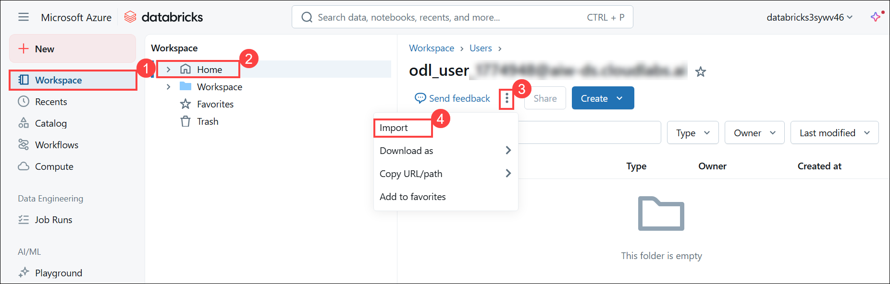
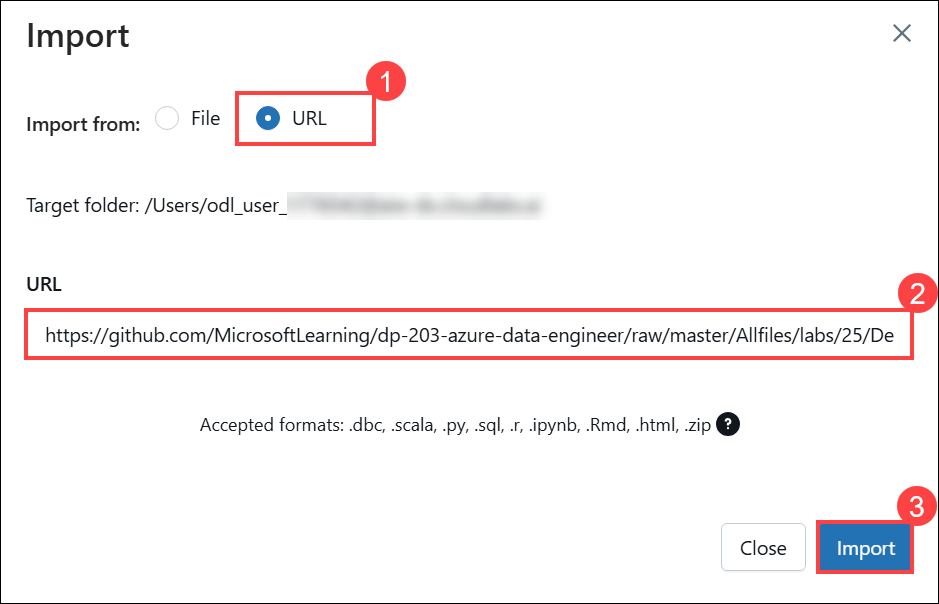
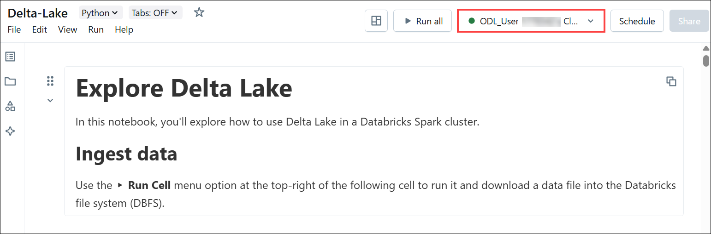

# Lab 03: Use Delta Lake in Azure Databricks

## Overview

Delta Lake is an open-source project to build a transactional data storage layer for Spark on top of a data lake. Delta Lake adds support for relational semantics for both batch and streaming data operations, and enables the creation of a *Lakehouse* architecture in which Apache Spark can be used to process and query data in tables that are based on underlying files in the data lake.

In this lab, you'll learn about Delta Lake which is an open source relational storage area for Spark that you can use to implement a data lakehouse architecture in Azure Databricks.

### Lab Objectives

In this lab, you will perform:

 - Task 1: Provision an Azure Databricks workspace
 - Task 2: Create a cluster
 - Task 3: Explore the data lake using a notebook

## Task 1:  Provision an Azure Databricks workspace

In this task, you'll use a script to provision a new Azure Databricks workspace.

1. In a web browser, navigate to the **Azure portal**, open the following URL in the address bar, and sign in with the Lab credentials if you are not already signed in.

    ```
    https://portal.azure.com
    ```
   
1. Use the **[\>_]** **icon** to the right of the search bar to create a new **Cloud Shell** in the Azure portal.

    

1. In the **Welcome to Azure Cloud Shell** pane, select **PowerShell**.

    

1. Within the Getting started pane, select **Mount storage account (1)**, select your **Storage account subscription (2)** from the dropdown and click **Apply (3)**.

    

1. In the **Mount storage account** pane, select **I want to create a storage account (1)** and click **Next (2)**.

    

1. In the **Create storage account** pane, provide the following details:

    - **Subscription (1)**: Select the defualt **Subscription**  
    - **Resource group (2)**: Select **Azure-Databricks**  
    - **Region (3)**: Select **(US) East US**  
    - **Storage account name (4)**: Enter **storage<inject key="DeploymentID" enableCopy="false"/>**  
    - **File share (5)**: Enter **fileshare1**  
    - select **Create (6)**.

        

1. In the **Deployment is in progress** notification, wait for the PowerShell terminal to start.

    

1. In the PowerShell pane, paste the following **commands** and click **Enter** to clone this repo:

    ```
    rm -r dp-203-azure-data-engineer -f
    git clone -b guidedlabs --single-branch https://github.com/CloudLabs-MOC/dp-203-azure-data-engineer.git
    ```

    

1. After the repo has been cloned, enter the following commands to change to the folder for this lab and run the **setup.ps1** script it contains:

    ```
    cd dp-203-azure-data-engineer/Allfiles/labs/25
    ./setup.ps1
    ```

1. Wait for the script to complete (this may take a few minutes), and while waiting, review the following documentation.

    ```
    https://learn.microsoft.com/azure/databricks/introduction/delta-comparison
    ```

1. In the **Cloud Shell** window, select the **X** at the top right corner to close it after the script execution completes.

   

## Task 2: Create a cluster

Azure Databricks is a distributed processing platform that uses Apache Spark *clusters* to process data in parallel on multiple nodes. Each cluster consists of a driver node to coordinate the work and worker nodes to perform processing tasks.

In this task, you'll create a *single-node* cluster to minimize the compute resources used in the lab environment (in which resources may be constrained). In a production environment, you'd typically create a cluster with multiple worker nodes.

1. In the **Search resources, services, and docs (G+/) (1)** box, enter **dp203-<inject key="DeploymentID" enableCopy="false"/>**, and then select the **Resource group (2)**.

    
 
1. In the **Overview (1)** page, select the **databricks<inject key="DeploymentID" enableCopy="false"/> (2)** resource.

    

1. In the **Overview** page, select **Launch Workspace**.

    

    > **Note**: In the Databricks Workspace portal, dismiss any tips or notifications that appear, and continue with the lab instructions.

1. View the **Azure Databricks workspace portal** and note that the sidebar on the left side contains links for the various types of tasks you can perform.

1. Select the **+ New (1)** link in the sidebar, and then select **More (2)** ,then click on **Cluster (3)**.

    
 
1. In the **Create new compute** page, provide the following details:

    - **Compute name (1)**: Keep the **default** value  
    - **Databricks runtime (2)**: Select **13.3 LTS**  
    - **Preferred node type (3)**: Select **Standard_DS3_v2**  
    - **Single node (4)**: Select  
    - **Terminate after (5)**: Enter **30** minutes  
    - select **Create (6)**.

        

1. In the cluster page, wait until the status indicator shows the cluster is running.

    

    > **Note**: If your cluster fails to start, your subscription may have insufficient quota in the region where your Azure Databricks workspace is provisioned. See [CPU core limit prevents cluster creation](https://docs.microsoft.com/azure/databricks/kb/clusters/azure-core-limit) for details. If this happens, you can try deleting your workspace and creating a new one in a different region. You can specify a region as a parameter for the setup script like this: `./setup.ps1 eastus`

## Task 3: Explore Delta Lake using a notebook

In this task, you'll use code in a notebook to explore Delta Lake in Azure Databricks.

1. In the Azure Databricks workspace portal for your workspace, in the sidebar on the left, select **Workspace (1)**. Then select the **&#8962; Home (2)** folder.

1. At the top of the page, in the **&#8942; (3)** menu next to your user name, select **Import (4)**.

   

1. Then in the **Import** dialog box, select **URL (1)** , in the **URL** import the notebook from the following url.

    ```
    https://github.com/CloudLabs-MOC/dp-203-azure-data-engineer/raw/guidedlabs-Azure-Databricks/Allfiles/labs/25/Delta-Lake.ipynb
    ```

   
   
1. Connect the notebook to your cluster, and follow the instructions it contains, running the cells it contains to explore Delta Lake functionality.

   >**Note:** While running the cells upon following the instructions, if the execution is delayed, please wait for 15-20 minutes.

   

> **Congratulations** on completing the task! Now, it's time to validate it. Here are the steps:
> - Hit the Validate button for the corresponding task. If you receive a success message, you can proceed to the next task. 
> - If not, carefully read the error message and retry the step, following the instructions in the lab guide.
> - If you need any assistance, please contact us at cloudlabs-support@spektrasystems.com. We are available 24/7 to help
 
<validation step="0dca010a-adbc-4610-a1dc-52baca77d863" />

## Summary

In this lab, you have performed essential tasks with Azure Databricks. You provisioned an Azure Databricks workspace, created a cluster, and explored data using a notebook to gain valuable insights.

## You have successfully completed the lab.
