# Lab 05: Automate an Azure Databricks Notebook with Azure Data Factory

## Lab Scenario

You can use notebooks in Azure Databricks to perform data engineering tasks, such as processing data files and loading data into tables. When you need to orchestrate these tasks as part of a data engineering pipeline, you can use Azure Data Factory. 

In this lab, you'll explore notebooks in Azure Databricks to perform data engineering tasks, such as processing data files and loading data into tables.

### Lab Objectives

In this lab, you will perform:

 - Task 1: Provision Azure resources
 - Task 2: Import a notebook
 - Task 3: Enable Azure Databricks integration with Azure Data Factory
 - Task 4: Use a pipeline to run the Azure Databricks notebook

## Task 1: Provision Azure resources

In this task, you'll use a script to provision a new Azure Databricks workspace and an Azure Data Factory resource in your Azure subscription.

1. In a web browser, navigate to the **Azure portal**, open the following URL in the address bar, and sign in with the Lab credentials if you are not already signed in.

   ```
   https://portal.azure.com
   ```
   
1. Use the **[\>_]** **icon** to the right of the search bar to create a new **Cloud Shell** in the Azure portal.

   

1. In the **Welcome to Azure Cloud Shell** pane, select **PowerShell**.

   

1. Within the Getting started pane, select **Mount storage account (1)**, select your **Storage account subscription (2)** from the dropdown and click **Apply (3)**.

   

1. In the **Mount storage account** pane, select **I want to create a storage account (1)** and click **Next (2)**.

   

1. In the **Create storage account** pane, provide the following details:

   - **Subscription (1)**: Select the defualt **Subscription**  
   - **Resource group (2)**: Select **Azure-Databricks**  
   - **Region (3)**: Select **(US) East US**  
   - **Storage account name (4)**: Enter **storage<inject key="DeploymentID" enableCopy="false"/>**  
   - **File share (5)**: Enter **fileshare1**  
   - select **Create (6)**.

      

1. In the **Deployment is in progress** notification, wait for the PowerShell terminal to start.

   

1. In the PowerShell pane, paste the following **commands** and click **Enter** to clone this repo:

   ```
   rm -r dp-203-azure-data-engineer -f
   git clone -b guidedlabs --single-branch https://github.com/CloudLabs-MOC/dp-203-azure-data-engineer.git
   ```

   

1. After the repo has been cloned, enter the following commands to change to the folder for this lab and run the **setup.ps1** script it contains:

    ```
    cd dp-203-azure-data-engineer/Allfiles/labs/27
    ./setup.ps1
    ```

1. Wait for the script to complete (this may take a few minutes), and while waiting, review the following documentation.

   ```
   https://docs.microsoft.com/azure/data-factory/introduction
   ```

1. In the **Cloud Shell** window, select the **X** at the top right corner to close it after the script execution completes.

   

## Task 2: Import a notebook

You can create notebooks in your Azure Databricks workspace to run code written in a range of programming languages. 

In this task, you'll import an existing notebook that contains some Python code.

1. In the **Search resources, services, and docs (G+/) (1)** box, enter **dp203-<inject key="DeploymentID" enableCopy="false"/>**, and then select the **Resource group (2)**.

   
 
1. In the **Overview (1)** page, select the **databricks<inject key="DeploymentID" enableCopy="false"/> (2)** resource.

   

1. In the **Overview** page, select **Launch Workspace**.

   
 
    > **Note**: As you use the Databricks Workspace portal, various tips and notifications may be displayed. Dismiss these and follow the instructions provided to complete the tasks in this exercise.

1. View the Azure Databricks workspace portal and note that the sidebar on the left side contains icons for the various tasks you can perform.

1. Select **Workspace (1)** from the left navigation pane, and then choose **Home (2)** under the Workspace section.

   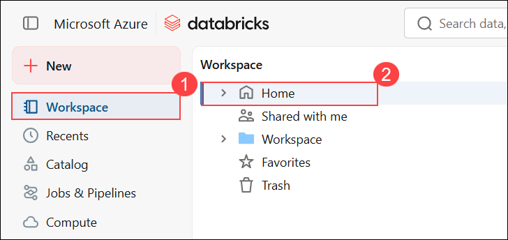

1. Select the **More options (1)** menu, and then choose **Import (2)**.

   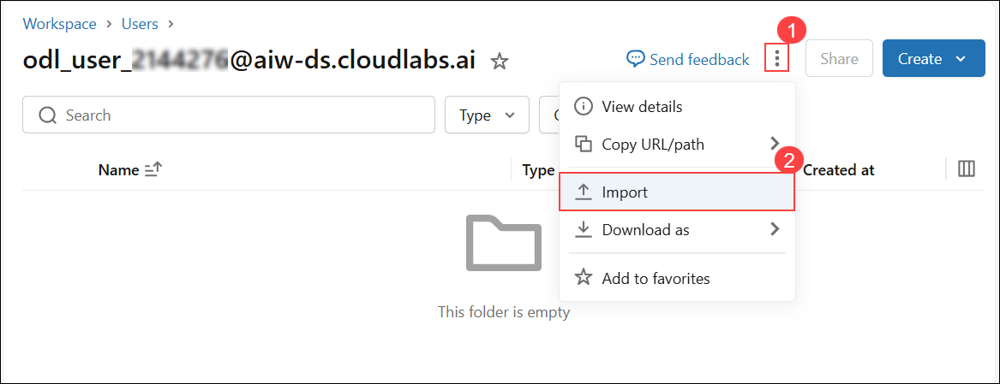

1. In the **Import** dialog box, select **URL (1)**, enter the provided link in the **URL (2)** field, and then choose **Import (3)**.

    ```
    https://github.com/CloudLabs-MOC/dp-203-azure-data-engineer/raw/guidedlabs-Azure-Databricks/Allfiles/labs/27/Process-Data.ipynb
    ```

    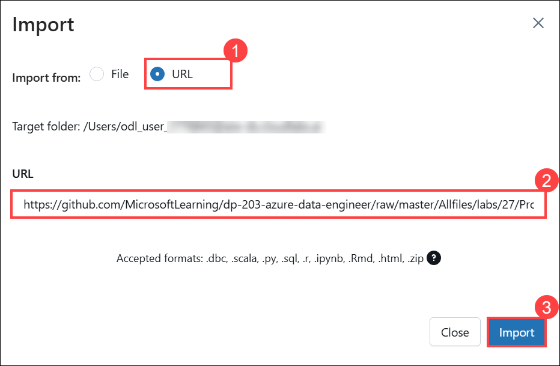

1. Review the contents of the notebook, which include some Python code cells to:
    - Retrieve a parameter named **folder** if it has been passed (otherwise use a default value of *data*).
    - Download data from GitHub and save it in the specified folder in the Databricks File System (DBFS).
    - Exit the notebook, returning to the path where the data was saved as an output

       > **Note**: The notebook could contain practically any data processing logic you need. This simple example is designed to show the key principles.

## Task 3: Enable Azure Databricks integration with Azure Data Factory

To use Azure Databricks from an Azure Data Factory pipeline, you need to create a linked service in Azure Data Factory that enables access to your Azure Databricks workspace.

In this task, you will generate an access token in the Azure Databricks Portal.

### Task 3.1: Generate an access token

1. In the **Azure Databricks portal**, on the top right menu bar, select the **username (1)** and then select **Settings (2)** from the drop-down.

    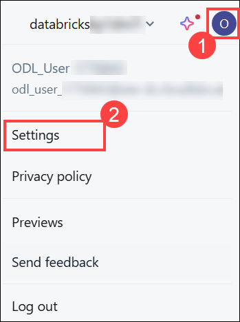
   
1. In the **Settings** page, select **Developer (1)**. Then, next to **Access tokens** select **Manage (2)**.

    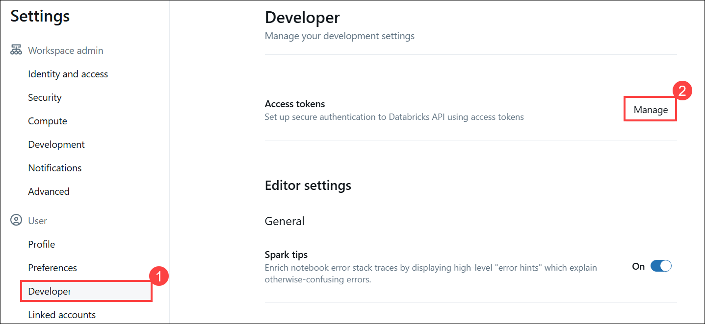
   
1. Select **Generate new token(1)** and generate a new token with the comment **Data Factory (2)** and a  lifetime(days) as **90 (3)**, and then click on **Generate (4)**

    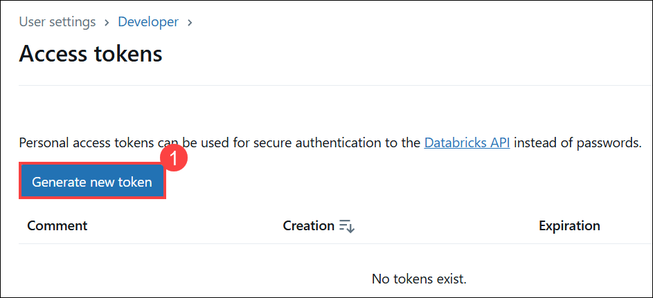

    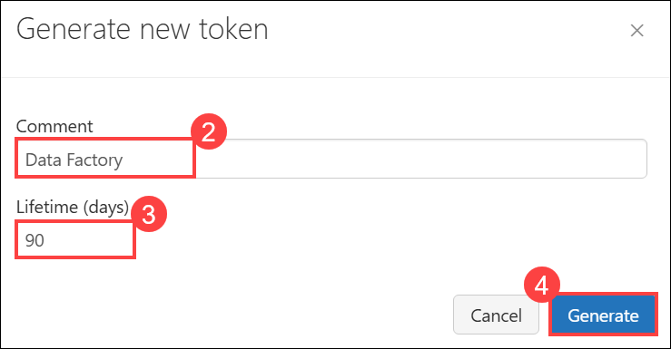

1. Be careful to **copy (1) the token when it is displayed <u>before</u> selecting *Done (2)***

   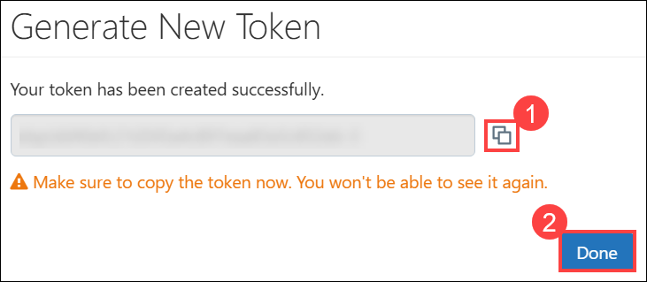

1. Paste the copied token into a text file so you have it handy for later in this exercise.

### Task 3.2: Create a linked service in Azure Data Factory

1. Return to the Azure portal, and in the **dp203-*xxxxxxx*** resource group, select the **adf*xxxxxxx*** Azure Data Factory resource.

    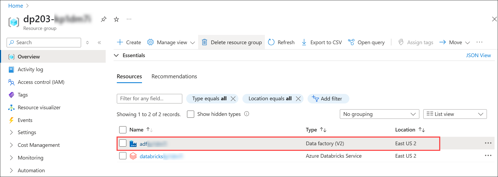
   
1. On the **Overview** page, select the **Launch studio** to open the Azure Data Factory Studio. Sign in if prompted.

    
   
1. In Azure Data Factory Studio, use the **>> icon** to expand the navigation pane on the left. Then select the **Manage** page.

   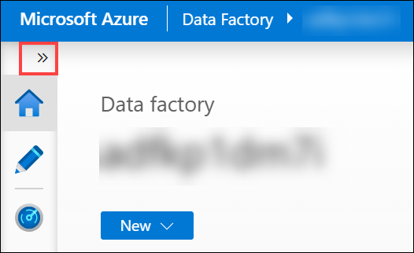

   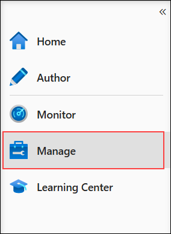
   
1. On the **Manage** page, in the **Linked services (1)** tab, select **+ New (2)** to add a new linked service.

   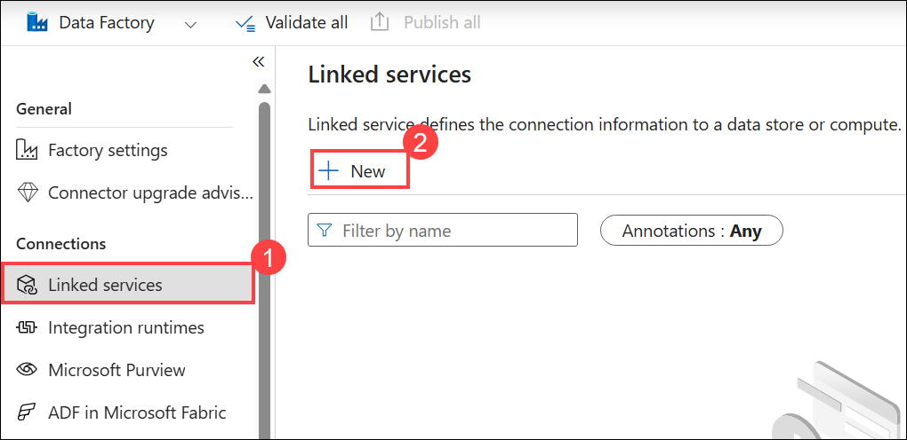
   
1. In the **New linked service** pane, select the **Compute (1)** tab at the top. Then select **Azure Databricks (2)** and click on **Continue (3).**

   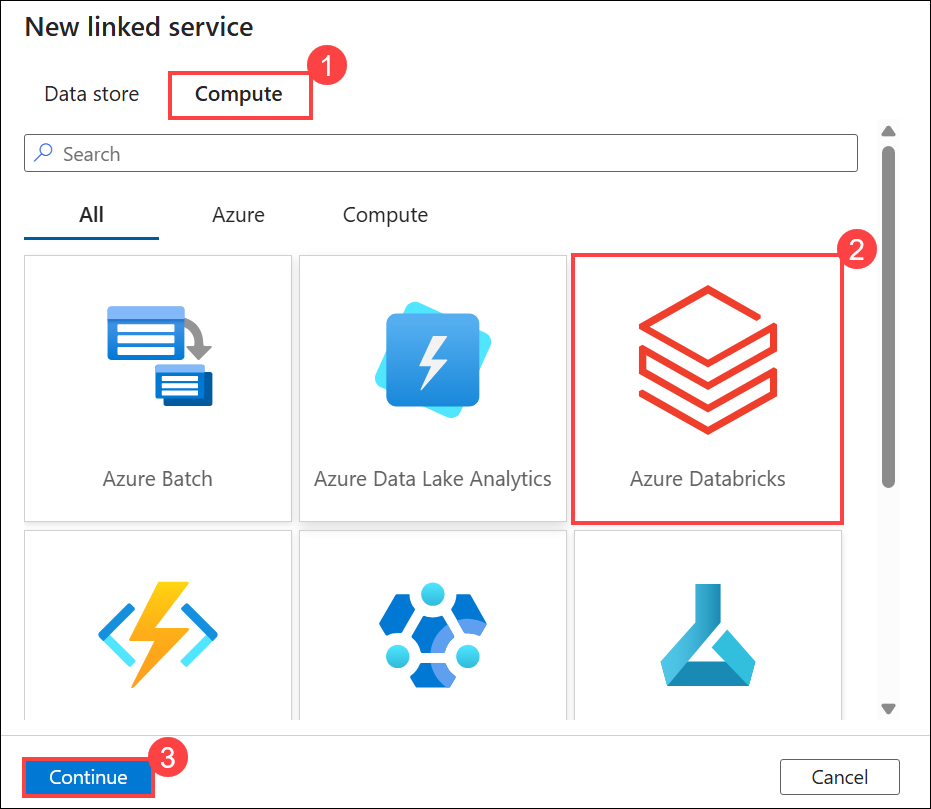
   
1. Create the linked service with the following settings:
    - **Name (1)**: AzureDatabricks
    - **Description (2)**: Azure Databricks workspace
    - **Connect via integration runtime (3)**: AutoResolveInegrationRuntime
    - **Account selection method (4)**: From Azure subscription
    - **Azure subscription (5)**: *Select your subscription*
    - **Databricks workspace (6)**: *Select your **databricksxxxxxxx** workspace*
    - **Select cluster (7)**: New job cluster
    - **Databrick Workspace URL (8)**: *Automatically set to your Databricks workspace URL*
    - **Authentication type (9)**: Access token
    - **Access token (10)**: *Paste your access token*
    - **Cluster version (11)**: 13.3 LTS (includes Apache Spark 3.4.1, Scala 2.12)
    - **Cluster node type (12)**: Standard_DS3_v2
    - **Python version (13)**: 3
    - **Worker options (14)**: Fixed
    - **Workers (15)**: 1
  
      Once all the necessary fields are provided, click on **Create (16).**

    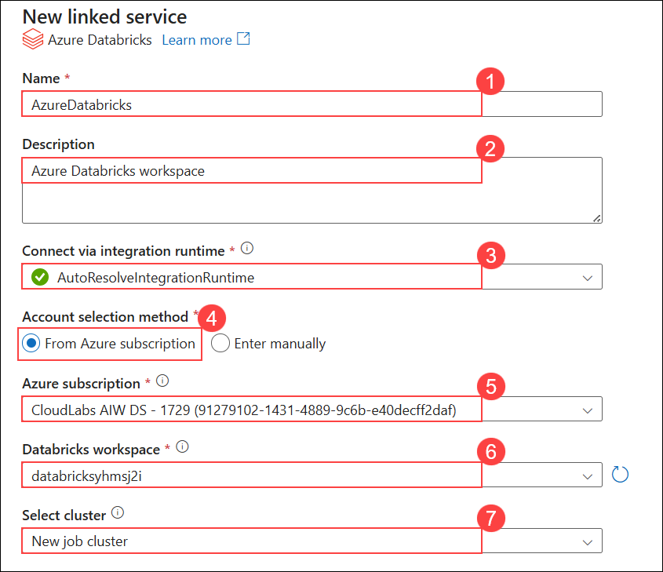

    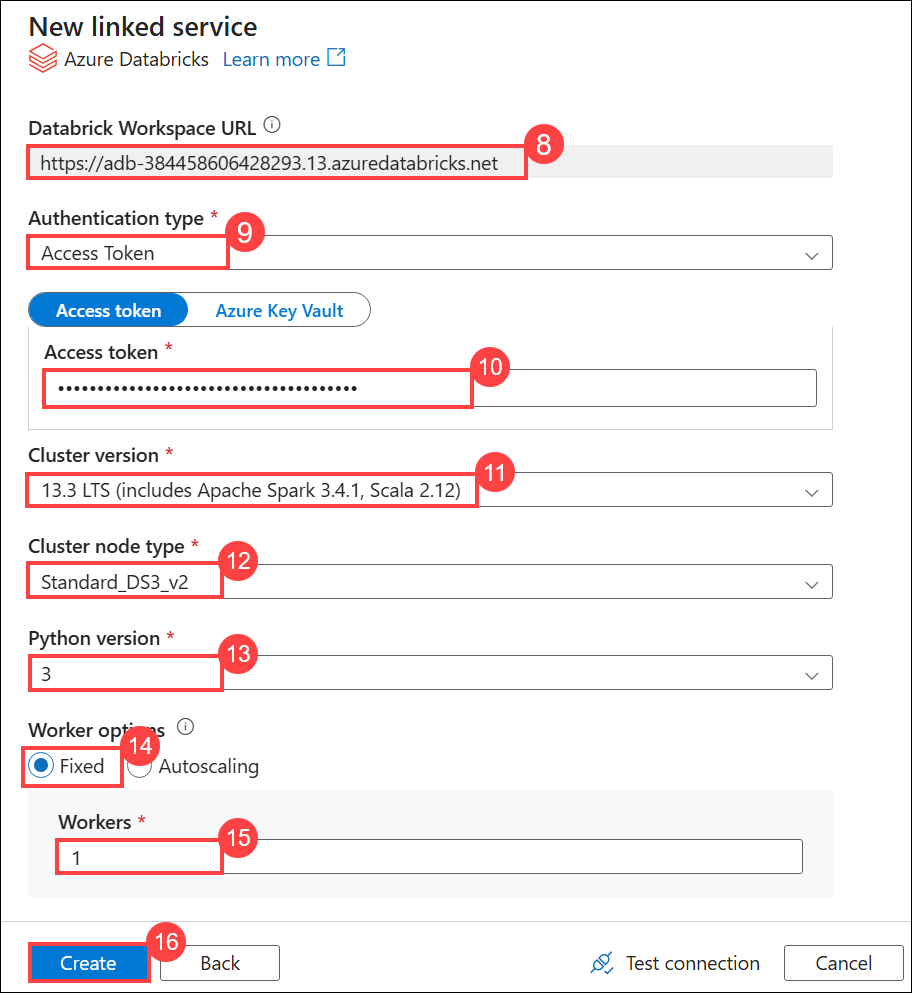

## Task 4: Use a pipeline to run the Azure Databricks notebook

Now that you have created a linked service, you can use it in a pipeline to run the notebook you viewed previously.

In this task, you will create a pipeline and use it to run the Azure Databricks Notebook.

### Task 4.1: Create a pipeline

1. In Azure Data Factory Studio, in the navigation pane, select **Author (1)**.
   
1. On the **Author** page, in the **Factory Resources** pane, use the **+ (2)** icon then choose **Pipeline (3) > Pipeline (4)**. to add a **Pipeline**.
    
   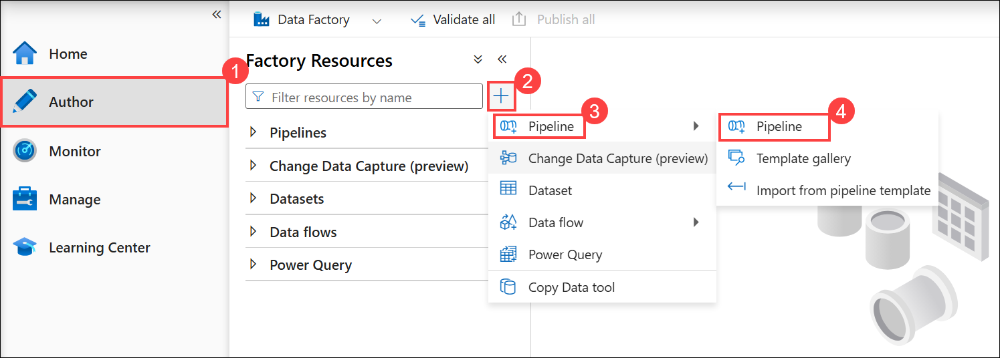
   
1. In the **Properties** pane for the new pipeline, change its name to **Process Data with Databricks (1)**. Then use the **Properties (2)** button (which looks similar to **&#128463;<sub>*</sub>**) on the right end of the toolbar to hide the **Properties** pane.

    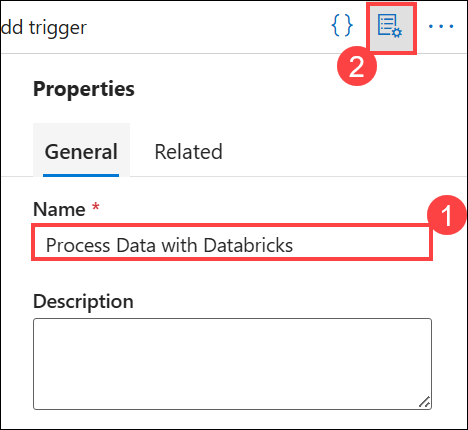
   
1. In the **Activities (1)** pane, expand **Databricks (2)** and drag a **Notebook (3)** activity to the pipeline designer surface.

   
   
1. With the new **Notebook1** activity selected, set the following properties in the bottom pane:
    - **General**:
        - **Name**: Process Data **(1)**
    - **Azure Databricks (2)**:
        - **Databricks linked service**: Select the **AzureDatabricks (3)** linked service you created previously

    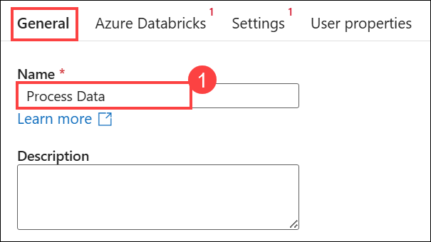

    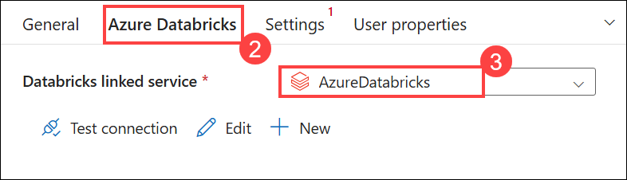 

1. In the **Settings (1)** tab, select **Browse (2)** to choose the notebook path.

   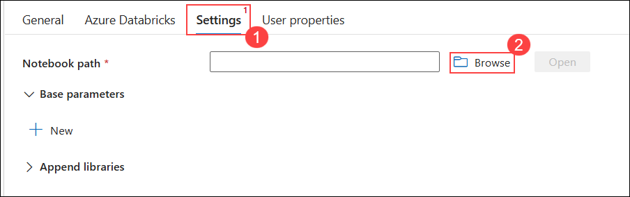

1. In the **Browse** dialog box, select **Users**.

   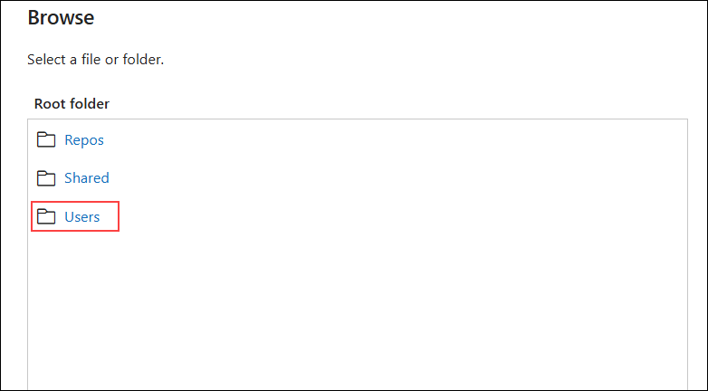

1. In the **Users** folder, select **<inject key="AzureAdUserEmail"></inject>**.

   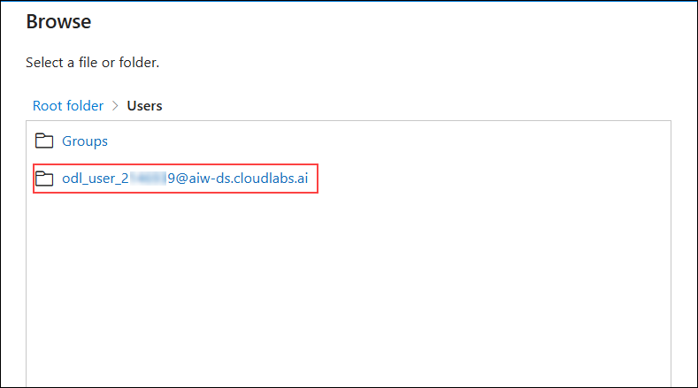

1. In the **Browse** dialog box, select **Process-Data (1)**, and then choose **OK (2)**.

   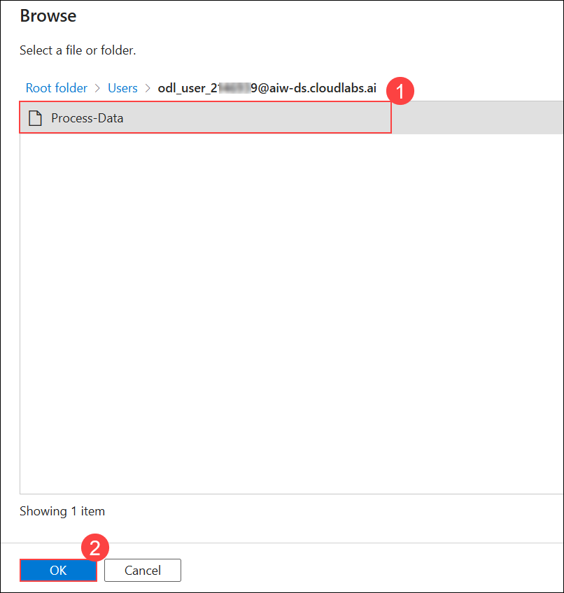

1. Under **Base parameters**, select **New (1)**, enter **folder (2)** in the **Name** field, and set the **Value (3)** to **product_data**.

   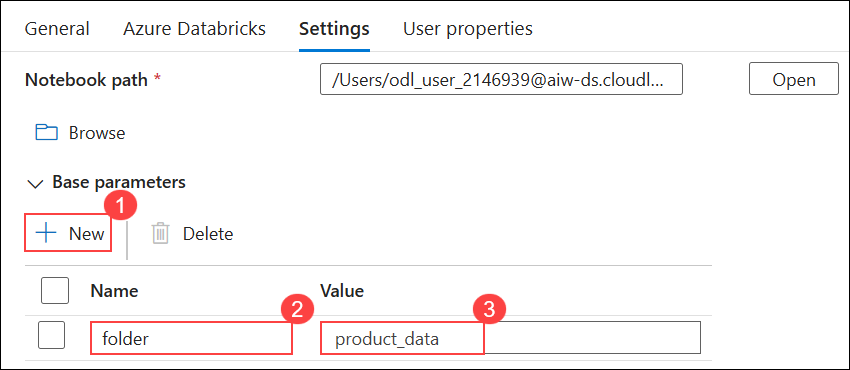
       
1. Use the **Validate (1)** button above the pipeline designer surface to validate the pipeline. Then use the **Publish all (2)** button to publish (save) it, and click **Publish (3)** finally.

    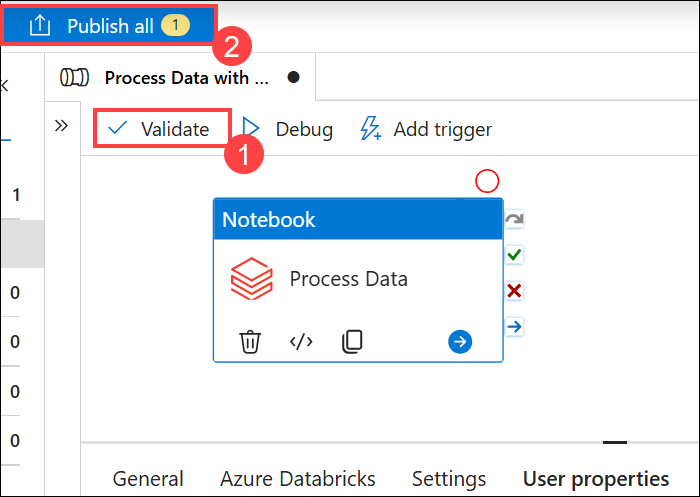

    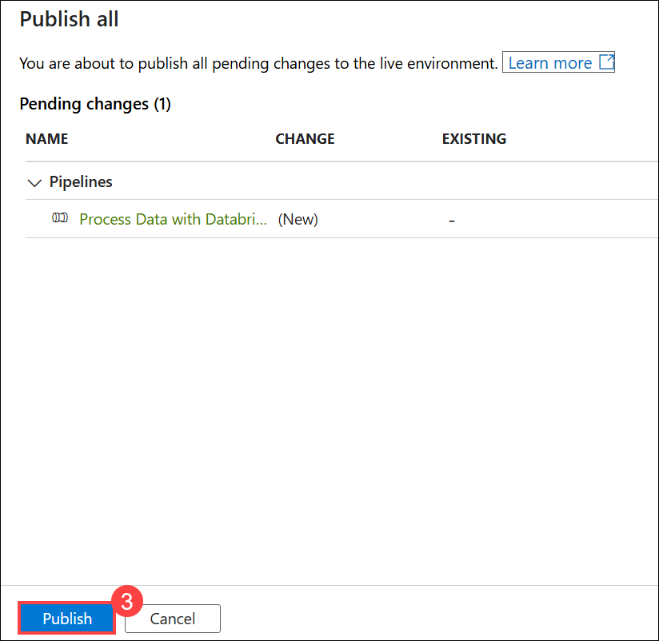
   
### Task 4.2: Run the pipeline

1. Above the pipeline designer surface, select **Add trigger (1)**, and then select **Trigger now (2)**.

    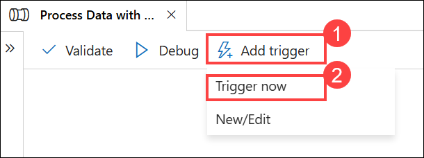
   
1. In the **Pipeline run** pane, select **OK** to run the pipeline.
   
1. In the navigation pane on the left, select **Monitor (1)** and observe the **Process Data with Databricks** pipeline on the **Pipeline runs** tab. It may take a while to run as it dynamically creates a Spark cluster and runs the notebook. You can use the **&#8635; Refresh (2)** button on the **Pipeline runs** page to refresh the status.

   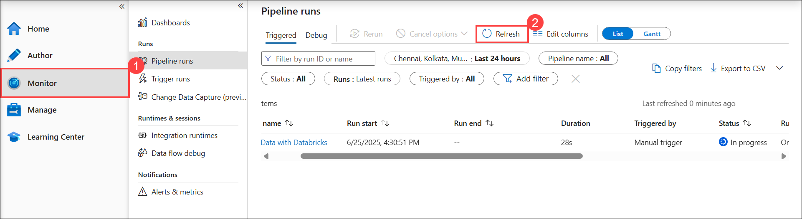

    > **Note**: If your pipeline fails, your subscription may have insufficient quota in the region where your Azure Databricks workspace is provisioned to create a job cluster. See [CPU core limit prevents cluster creation](https://docs.microsoft.com/azure/databricks/kb/clusters/azure-core-limit) for details. If this happens, you can try deleting your workspace and creating a new one in a different region. You can specify a region as a parameter for the setup script like this: `./setup.ps1 eastus`

1. When the run succeeds, select its name to view the run details. Then, on the **Process Data with Databricks** page, in the **Activity Runs** section, select the **Process Data** activity and use its ***output*** icon to view the output JSON from the activity, which should resemble this:
    ```json
    {
        "runPageUrl": "https://adb-..../run/...",
        "runOutput": "dbfs:/product_data/products.csv",
        "effectiveIntegrationRuntime": "AutoResolveIntegrationRuntime (East US)",
        "executionDuration": 61,
        "durationInQueue": {
            "integrationRuntimeQueue": 0
        },
        "billingReference": {
            "activityType": "ExternalActivity",
            "billableDuration": [
                {
                    "meterType": "AzureIR",
                    "duration": 0.03333333333333333,
                    "unit": "Hours"
                }
            ]
        }
    }
    ```

    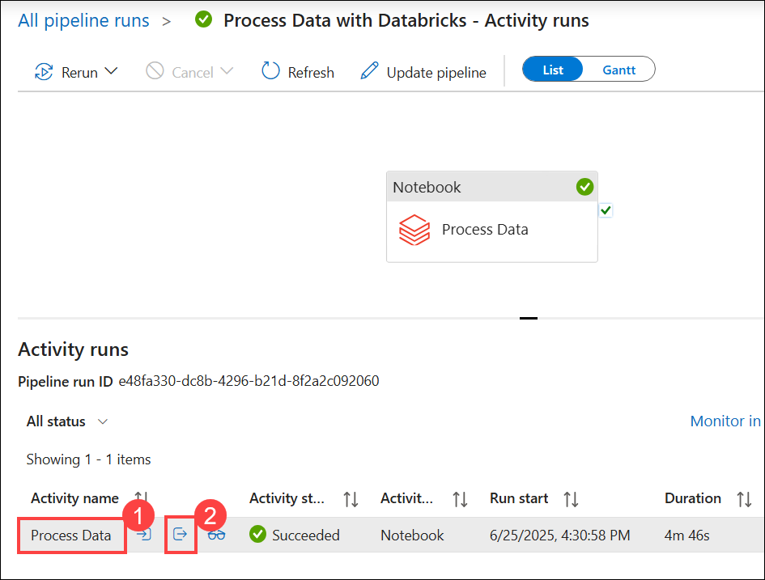

1. Note the **runOutput** value, which is the *path* variable to which the notebook saved the data.

> **Congratulations** on completing the task! Now, it's time to validate it. Here are the steps:
> - Hit the Validate button for the corresponding task. If you receive a success message, you can proceed to the next task. 
> - If not, carefully read the error message and retry the step, following the instructions in the lab guide.
> - If you need any assistance, please contact us at cloudlabs-support@spektrasystems.com. We are available 24/7 to help

<validation step="ea0c803b-47db-4f2f-9936-d54c0e8228c1" />

 ## Summary

In this lab, you have performed tasks to integrate Azure Databricks with Azure Data Factory. You imported a notebook, enabled Azure Databricks integration with Azure Data Factory, and used a pipeline to run the Azure Databricks notebook efficiently.
 
 ## You have successfully completed the lab.
